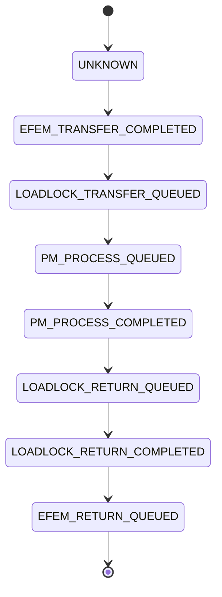

# LL/PM2/WTR 调度排查与修复计划

## Summary

* 目标：只围绕当前真实工况 `LP -> LL -> PM2 -> LL -> LP` 梳理调度流程，画出现状流程图，找出当前 bug 的主因，并给出一版可直接落地的修复步骤。

* 范围文件：

  * `d:\HLPrj\HL\device\src\slot_transfer_cycle_vtm_widget.cpp`

  * `d:\HLPrj\HL\device\src\TaskManager.cpp`

  * `d:\HLPrj\HL\device\include\UnifiedWaferTask.h`

* 当前边界：

  * 只考虑 `PM2`

  * `3.2` 里的 `LL -> PM2 pending` 逻辑按你的说明视为正确，不作为本轮主问题

  * `LL` 线程只负责 LL 侧动作和“返回 LL”请求

  * `PM2` 线程负责完成对 `PM2` 的完整交互

  * `PM` 任务状态只关注 `pending` 和 `completed`，不引入 `in_progress`

* 硬件约束：WTR 双臂共用同一套旋转机构，旋转到位前两臂都不能取放；旋转到位后两臂也只能串行动作。

## Current State Analysis

### 1. 当前代码里的参与线程

* `EFEM` 线程：负责 `LP <-> LL`

* `LLA / LLB` 线程：负责各自 LL 的门阀、真空、从 LL 取片、回 LL 放片

* `PM2` 线程：负责 `PM2` 侧取放、交换、工艺等待

* `Robot` 线程：真正执行 WTR `get / put / exchange`

* `TaskManager`：只负责任务状态映射与查询，不掌握真实持片主体

### 2. 当前 PM2 目标流程

按你给出的职责边界，目标链路应该是：


这里最关键的分工是：

* `LL` 不负责“从 PM2 取片”

* `PM2` 负责把片从 `WTR -> PM2 -> WTR`

* `LL` 只消费“已经回到 WTR 上的返回片”，然后放回 LL

### 3. 当前代码里的实际现状

#### 3.1 LP -> LL

* `EFEM` 把片送到 `LLA/LLB`

* `LLA/LLB` 把任务推进到 `LOADLOCK_TRANSFER/QUEUED`

#### 3.2 LL -> PM2

* `LLA/LLB` 在 `1051/1055/1052` 请求 `Robot` 从 LL 取片

* 取片成功后推进到 `PM_PROCESS/QUEUED`

* 这一段按当前业务定义表示“PM 待处理”，本轮视为正确

#### 3.3 PM2 线程

* `PM2` 在线程 `100 -> 200` 判断当前是：

  * 放片

  * 从 PM2 取片

  * 交换

  * 最终取片

* `2000` 做工艺，工艺结束后把任务改成：

  * `PM_PROCESS/COMPLETED`

  * `LOADLOCK_RETURN/QUEUED`

* 但 `2000` 后的非交换场景只是设置 `pm2_need_return_wafer = true`，进入 `300` 等待，并没有先执行一次“从 PM2 取回到 WTR”

#### 3.4 LL 回程

* 当前 `LLA/LLB` 的回程在实际跑的分支里会直接走到 `2060`

* 也就是说，当前有效设计已经默认：

  * 晶圆在进入 `2060` 前已经被放到了 WTR 手臂上

* 因此在你当前工况下，`2055/2056` 不是主通路，不作为本轮主问题

### 4. 已确认的主因

#### 根因 A：`UpdatePmSubTransferDatas("PM2")` 把 `completed` 读错成 `pending`

位置：`slot_transfer_cycle_vtm_widget.cpp`

现状：

```cpp
pm2PendingTasks = taskManager.getPMPendingTasks(pmName);
pm2CompletedTasks = taskManager.getPMPendingTasks(pmName);
pm2ProgressingTasks = taskManager.getPMPendingTasks(pmName);
```

在本轮业务里，真正相关的是前两项：

* `pm2PendingTasks`

* `pm2CompletedTasks`

影响：

* `pm2CompletedTasks` 永远拿不到真正的 `PM_PROCESS/COMPLETED`

* `PM2` 工艺后续、回程允许条件、回程结束后是否还有待处理片，都会基于错误数据判断

#### 根因 B：PM2 非交换工艺完成后，没有把片从 `PM2` 取回到 `WTR`

位置：`PM2` 线程 `2000 -> 300`

现状：

* `2000` 做完工艺后，直接执行：

  * `PM_PROCESS/COMPLETED`

  * `LOADLOCK_RETURN/QUEUED`

  * `pm2_need_return_wafer = true`

* 然后在 `300` 里只是等待“LL 已取回晶圆”

* 但在这之前，并没有固定执行 `robot_get_from_pm2`

这与当前 LL 回程主路径直接走 `2060` 的假设冲突：

* `2060` 假设返回片已经在 WTR 上

* `PM2` 非交换工艺路径却没有保证这一点

这就是本轮最核心的职责错位。

#### 根因 C：LL 回程 `2060` 仍然依赖 `task.arm`，没有消费 PM2 实际回传臂

位置：

* `LLA` `2060`

* `LLB` `2060`

现状：

* `2060` 放回 LL 时使用的是 `loadLock*ReturnPendingTasks.front().arm`

* 这个 `arm` 是任务初始化的静态手臂选择

* 但一旦由 `PM2` 线程负责“从 PM2 取回到 WTR”，实际载片臂应以 `PM2` 最终执行成功的那只手臂为准

影响：

* 即使把根因 B 修好，只要 LL 继续按初始 `task.arm` 放回 LL，就仍可能出现“WTR 实际载片臂”和“LL 放片命令臂”不一致

#### 根因 D：本轮业务里并不需要 `PM in_progress`，但代码仍保留了这套错误分支

位置：`UpdatePmSubTransferDatas()` 和计划外的 `pmProgressingTasks`

现状：

* 当前业务只区分：

  * `PM_PROCESS/QUEUED` 作为 PM 待处理

  * `PM_PROCESS/COMPLETED` 作为 PM 工艺后完成

* `pmProgressingTasks` 既不符合当前业务边界，也读错了数据来源

影响：

* 容易继续把“状态细化设计”和“当前实际调通路径”混在一起，越改越乱

## Proposed Changes

### 1. 先按 PM2 单腔链路重画流程图和状态边界

执行阶段先固化一份“只看 PM2”的流程说明，避免再次被 `PM1/PM3/PM4` 干扰：



说明：

* 不新增 `PM in_progress`

* `PM_PROCESS/QUEUED` 表示“待 PM2 处理”

* `PM_PROCESS/COMPLETED` 表示“PM2 工艺已完成，且应进入回程链路”

### 2. 修正 `UpdatePmSubTransferDatas("PM2")`

文件：`slot_transfer_cycle_vtm_widget.cpp`

修复内容：

* `pm2PendingTasks = taskManager.getPMPendingTasks("PM2")`

* `pm2CompletedTasks = taskManager.getPMCompletedTasks("PM2")`

* 移除或停用 `pm2ProgressingTasks` 在本轮路径中的作用

原因：

* 这是当前最确定、最直接影响 `PM2` 调度判断的 bug。

### 3. 收敛 PM2 与 LL 的职责边界

文件：`slot_transfer_cycle_vtm_widget.cpp`

本轮明确按以下边界改：

* `LLA / LLB` 负责：

  * 从 LL 取片到 WTR

  * 等待“返回片已在 WTR 上”

  * 把返回片放回 LL

* `PM2` 负责：

  * 把 WTR 上的片放到 PM2

  * 等工艺结束

  * 把 PM2 里的片重新取回到 WTR

落地要求：

* `PM2` 非交换流程在 `2000` 工艺完成后，不能只设置 `LOADLOCK_RETURN/QUEUED` 然后等待 LL

* 必须先走一条明确的“从 PM2 取回到 WTR”的动作

* 只有在 `robot_get_from_pm2` 成功后，才允许 LL 线程进入 `2060`

### 4. 为回程增加“实际返回臂”字段

文件：

* `UnifiedWaferTask.h`

* `TaskManager.cpp`

* `slot_transfer_cycle_vtm_widget.cpp`

修复内容：

* 为任务增加一个“当前返回片所在手臂”字段，例如：

  * `currentArm`

  * 或 `returnArm`

* `PM2` 线程在 `robot_get_from_pm2` 成功后，把实际使用的手臂写回任务

* `LLA / LLB` 的 `2060` 只读取这个实时字段，不再直接依赖初始化时的 `task.arm`

### 5. 清理与当前 PM2 路径无关的干扰逻辑

文件：`slot_transfer_cycle_vtm_widget.cpp`

本轮不动大结构，但执行时需要避免被无关逻辑干扰：

* 不把 `2055/2056` 当成当前主问题去修

* 不以 `PM1/PM3/PM4` 为本轮优先修复目标

* 不继续围绕 `pmProgressingTasks` 设计新逻辑

### 6. 补最小闭环日志

文件：`slot_transfer_cycle_vtm_widget.cpp`

记录字段：

* `taskId`

* `target` 和 `target_pm`

* `taskType / status`

* `PM2` 实际 `get_from_pm2` 使用的 `arm`

* `LL 2060` 实际 `put_to_ll` 使用的 `arm`

* `WTR hasObject(0/1)`

* `PM2 / LL / Robot` 当前步骤号

目的：

* 明确看出 bug 是“PM2 没把片取回到 WTR”，还是“取回了但 LL 用错臂”

## Assumptions & Decisions

* 决策：本轮只针对 `PM2` 路径设计和执行，不把 `PM1/PM3/PM4` 一起重构。

* 决策：`3.2` 中 `LL -> PM_PROCESS/QUEUED` 视为业务上正确的“PM 待处理”，不作为主因。<mccoremem id="01KRR0TZTB24509V46B9YCYQHW" />

* 决策：`2055/2056` 在当前真实跑法里不是主通路，先不以它为修复主线。<mccoremem id="01KRR0TZTB24509V46B9YCYQHW" />

* 决策：`PM` 状态只保留 `pending` 和 `completed` 两个业务关心态，不引入 `in_progress`。<mccoremem id="01KRR0TZTB24509V46B9YCYQHW" />

* 假设：`Robot` 单条 `createGetCommand/createPutCommand` 内部已经满足硬件旋转与取放顺序，当前 bug 主要在上层职责边界和状态推进上。

## Verification Steps

### 1. 静态验证

* 检查 `UpdatePmSubTransferDatas("PM2")` 是否只正确区分 `pending / completed`

* 检查 `PM2 2000` 工艺结束后，是否固定补上一次“从 PM2 取回到 WTR”

* 检查 `LL 2060` 是否读取“实际返回臂”而不是初始 `task.arm`

### 2. 日志验证

* 跑 1 片流程：`LP -> LLA/LLB -> PM2 -> LLA/LLB -> LP`

* 对照以下关键时刻：

  * 从 LL 取到 WTR

  * 放入 PM2

  * PM2 工艺结束

  * 从 PM2 取回到 WTR

  * 放回 LL

### 3. 验收标准

* 单片流程不出现：

  * PM2 工艺后晶圆仍留在 PM2，但 LL 已直接尝试 `2060` 放回 LL

  * `PM2` 取回成功的手臂与 `LL 2060` 放片手臂不一致

  * `0x3000 手臂已占`

* 双臂约束满足：

  * 任一时刻只有一个 WTR 动作在执行

  * 旋转结束后仍按单臂串行完成取放

## 计划执行顺序

1. 修正 `UpdatePmSubTransferDatas("PM2")` 的 `pending / completed` 查询。
2. 把 `PM2` 非交换工艺完成后的回程补完整：`PM2 -> WTR` 必须在 `LL -> 2060` 前完成。
3. 给任务增加“实际返回臂”并让 `LL 2060` 读取它。
4. 补日志并跑单片 `PM2` 闭环验证。

