# VTM（真空传输模块）项目完整设计方案

## 📋 目录
1. [项目概述](#项目概述)
2. [系统整体架构](#系统整体架构)
3. [核心组件架构](#核心组件架构)
4. [晶圆调度迁移机制](#晶圆调度迁移机制)
5. [任务状态机设计](#任务状态机设计)
6. [通信架构](#通信架构)
7. [UI组件体系](#ui组件体系)
8. [关键业务流程](#关键业务流程)

---

## 项目概述

### 系统简介
本项目是一个用于半导体制造的**真空传输模块（VTM, Vacuum Transfer Module）**图形用户界面控制系统。该系统负责协调和控制晶圆在不同工艺腔室间的自动化传输流程。

### 设备配置
```
┌─────────────────────────────────────────────────────┐
│               VTM 设备配置清单                       │
├─────────────────────────────────────────────────────┤
│ • LoadLock（负载锁）         ×2  （LLA、LLB）        │
│ • Wafer Robot（晶圆机器人）  ×1  （双臂机器人）      │
│ • Aligner（对准器）          ×1                     │
│ • TM Cavity（传输腔）        ×1                     │
│ • PM Cavity（工艺腔）        ×4  （PM1~PM4）        │
└─────────────────────────────────────────────────────┘
```

### 技术栈
- **开发语言**: C++
- **GUI框架**: Qt 5.x
- **构建工具**: CMake 3.0+
- **通信协议**: Modbus TCP
- **PLC品牌**: 基恩士(Keyence)、汇川(Inovance)
- **开发环境**: Visual Studio 2013
- **第三方库**: Poco (网络/通用工具)、Kernel框架

---

## 系统整体架构

### 分层架构设计

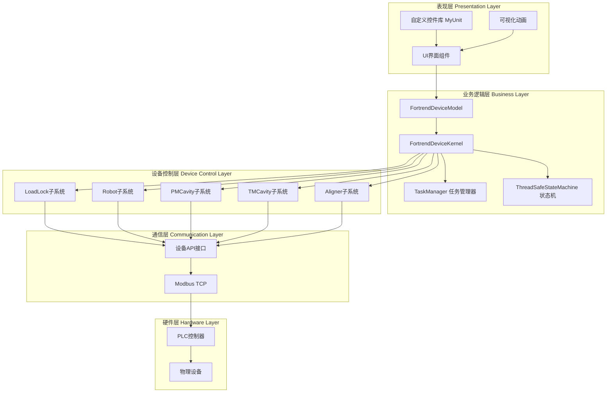

### MVC架构变体

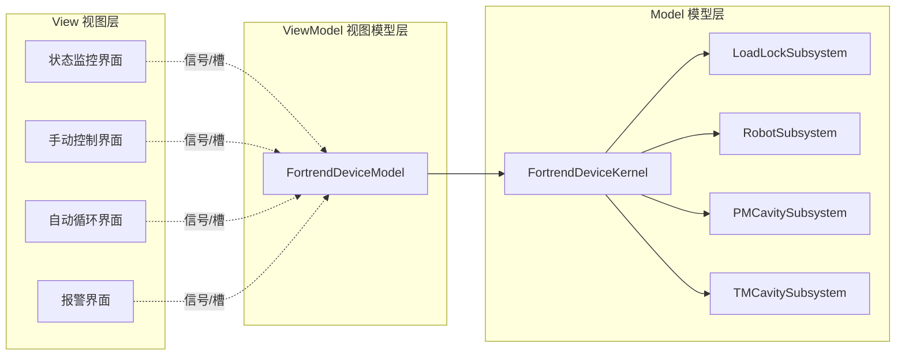

### 核心设计模式

| 设计模式 | 应用场景 | 核心类 |
|---------|---------|--------|
| **单例模式** | 任务管理器 | `TaskManager` |
| **命令模式** | 设备操作封装 | `*Command` 类族 |
| **观察者模式** | 状态同步 | Qt信号槽机制 |
| **状态机模式** | 任务流程控制 | `ThreadSafeStateMachine` |
| **工厂模式** | 子系统创建 | `FortrendDeviceKernel` |
| **策略模式** | 不同PLC协议 | `*API` 接口族 |

---

## 核心组件架构

### 1. 设备内核 (FortrendDeviceKernel)

```cpp
// 核心职责架构
class FortrendDeviceKernel : public IKernel
{
    核心职责:
    ├─ initialize()              // 系统初始化
    │  ├─ 创建所有子系统
    │  ├─ 建立通信连接
    │  ├─ 初始化状态机
    │  └─ 注册事件监听器
    │
    ├─ updateSubsystem()         // 周期性状态更新
    │  ├─ 读取设备状态
    │  ├─ 更新UI显示
    │  └─ 触发状态变更事件
    │
    └─ createAllSubResetAction() // 全局复位操作
       └─ 协调所有子系统复位
};
```

**组件关系图**:
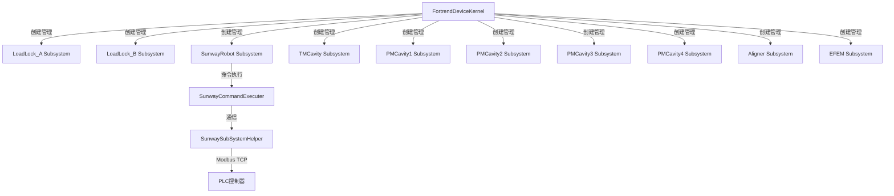

### 2. UI模型层 (FortrendDeviceModel)

```cpp
// UI组件组织架构
class FortrendDeviceModel : public IModule
{
    主要界面组件:
    ├─ status_widget              // 状态监控主界面
    │  └─ QFortrendStationStatusVTMWidget
    │
    ├─ efemmodule_tabWidget       // EFEM模块标签页
    │  ├─ LoadPort控制
    │  └─ Aligner控制
    │
    ├─ module_tabWidget           // 手动控制标签页
    │  ├─ LoadLock手动控制
    │  ├─ Robot手动控制
    │  ├─ TMCavity手动控制
    │  └─ PMCavity手动控制
    │
    ├─ control_widget             // 控制模式选择
    │  └─ QControlModeVTMWidget
    │
    ├─ slot_transfer_cycle_vtm_widget  // 自动循环测试
    │  └─ QSlotTransferCycleVTMWidget
    │
    └─ alarm                      // 报警显示
       └─ QKernelAlarmWidget
       
    关键方法:
    ├─ initialize()               // 模块初始化
    ├─ addMainCompoments()        // 添加主界面组件
    ├─ addManualCompoments()      // 添加手动控制界面
    ├─ addAutoCompoments()        // 添加自动循环界面
    ├─ addAlarmCompoments()       // 添加报警界面
    ├─ StatusOpen()               // 开启状态更新
    └─ StatusClose()              // 关闭状态更新
};
```

### 3. 子系统架构示例（以LoadLock为例）

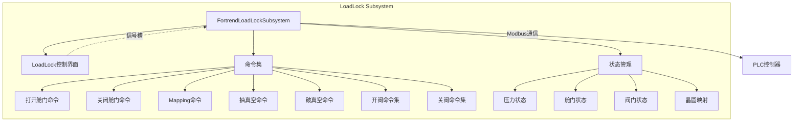

---

## 晶圆调度迁移机制

### 任务管理器 (TaskManager) 单例架构

```cpp
// TaskManager 核心职责
class TaskManager {
    核心数据结构:
    ├─ tasks_                     // 任务队列（原始配置）
    ├─ workTasks_                 // 实际工作任务队列
    ├─ taskStatusMap_             // 任务状态映射表
    │  └─ map<taskID, {TaskType, Status}>
    └─ taskTypeStatusMap_         // 类型-状态索引
       └─ map<TaskType, map<Status, vector<taskID>>>
       
    核心方法:
    ├─ 任务增删
    │  ├─ addTask()               // 添加任务
    │  ├─ popTask()               // 移除任务
    │  └─ clearTasks()            // 清空任务
    │
    ├─ 任务查询
    │  ├─ getTasksByLocation()    // 按位置查询
    │  ├─ getTasksByTypeAndStatus() // 按类型和状态查询
    │  ├─ getByIDFindTask()       // 按ID查询
    │  └─ getAllTasks()           // 获取所有任务
    │
    ├─ 状态更新
    │  ├─ updateTaskStatus()      // 更新任务状态
    │  └─ updateTaskMaps()        // 更新映射表
    │
    └─ 阶段查询（核心）
       ├─ getEfemUnkownStatusTasks()    // EFEM初始态
       ├─ getEfemPendingTasks()         // EFEM待上料
       ├─ getEfemCompletedTasks()       // EFEM上料完成
       ├─ getLoadLockPendingTasks()     // LL待处理
       ├─ getLoadLockCompletedTasks()   // LL处理完成
       ├─ getPMPendingTasks()           // PM待加工
       ├─ getPMProcessTasks()           // PM加工中
       ├─ getPMCompletedTasks()         // PM加工完成
       ├─ getLoadLockReturnPendingTasks()  // LL待回收
       └─ getEfemRuturnPendingTasks()      // EFEM待回收
};
```

### 统一晶圆任务数据结构

```cpp
// UnifiedWaferTask 完整定义
struct UnifiedWaferTask {
    // 位置枚举（8个位置）
    enum Location { LP1, LP2, LLA, LLB, PM1, PM2, PM3, PM4 };
    
    // 任务状态（5种状态）
    enum Status {
        QUEUED,           // 排队等待
        IN_PROGRESS,      // 执行中
        IN_ERROR,         // 执行错误
        COMPLETED,        // 已完成
        UNKNOWN_PROGRESS  // 未知进度
    };
    
    // 任务类型（6个阶段）
    enum TaskType {
        EFEM_TRANSFER,    // EFEM传输（LP→LL）
        LOADLOCK_TRANSFER,// LoadLock传输（LL→TM→PM）
        ROBOT_PROCESS,    // 机器人处理
        PM_PROCESS,       // PM腔加工
        LOADLOCK_RETURN,  // LoadLock回收（PM→TM→LL）
        EFEM_RETURN       // EFEM回收（LL→LP）
    };
    
    // 对准器状态
    enum AlignerStatus {
        ALIGNER_READY,    // 就绪
        ALIGNER_PROCESS,  // 对准中
        ALIGNER_COMPLETED // 对准完成
    };
    
    // 任务属性
    int taskId;                  // 任务唯一ID
    TaskType taskType;           // 当前任务类型
    Status status;               // 当前状态
    Location source;             // 源位置（如LP1）
    Location target;             // 目标位置1（如LLA）
    Location target_pm;          // 目标位置2（如PM1）
    int sourceSlot;              // 源槽位号
    int targetSlot;              // 目标槽位号
    int arm;                     // 机器人手臂选择(0=A, 1=B)
    AlignerStatus Aligner_status;// 对准器状态
    
    // PM使能配置
    std::array<int, 4> selectPmEnableList;
    bool pm1Enabled;
    bool pm2Enabled;
    bool pm3Enabled;
    bool pm4Enabled;
    
    // 标志位
    bool isLoadingInPlace;       // 是否已上料到LoadLock
    
    // 时间戳
    std::chrono::system_clock::time_point createdAt;
    std::chrono::system_clock::time_point startedAt;
    std::chrono::system_clock::time_point completedAt;
};
```

### 晶圆迁移状态转换图

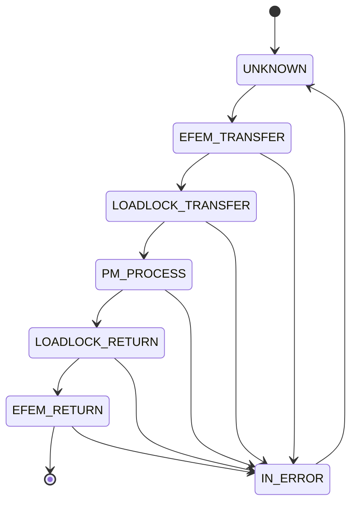

**状态说明**：

| 状态 | 说明 | 执行线程 | 主要操作 |
|------|------|---------|----------|
| **UNKNOWN** | 任务初始化 | - | 配置源/目标位置 |
| **EFEM_TRANSFER** | EFEM上料阶段 | executeEFEMTransfer | LP开盖→Mapping→取片→(对准)→放入LL |
| **LOADLOCK_TRANSFER** | LoadLock传输阶段 | executeLLATransfer/executeLLBTransfer | LL关门→抽真空→开TM门→Robot取片→放入PM |
| **PM_PROCESS** | PM工艺处理阶段 | executePM1~4Transfer | PM关门→工艺加工→完成→回取放片位 |
| **LOADLOCK_RETURN** | LoadLock回收阶段 | executeLLATransfer/executeLLBTransfer | Robot从PM取片→放回LL→关TM门→破真空 |
| **EFEM_RETURN** | EFEM卸料阶段 | executeEFEMTransfer | LL开舱门→Robot取片→放回LP槽位 |
| **IN_ERROR** | 错误状态 | 所有线程 | 记录错误→报警→等待复位 |

### 完整迁移流程图（双循环示例）

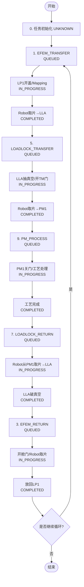

### 任务状态标识系统

| 编号 | 任务类型 | 状态 | 含义 | TaskManager方法 |
|-----|---------|------|------|----------------|
| 0 | UNKNOWN | - | 任务初始化 | `getEfemUnkownStatusTasks()` |
| 1 | EFEM_TRANSFER | QUEUED | 等待上料到LL | `getEfemPendingTasks()` |
| 2 | EFEM_TRANSFER | COMPLETED | 已上料到LL | `getEfemCompletedTasks()` |
| 3 | EFEM_RETURN | QUEUED | 等待回收到LP | `getEfemRuturnPendingTasks()` |
| 4 | EFEM_RETURN | COMPLETED | 已回收到LP | `getEfemRuturnCompletedTasks()` |
| 5 | LOADLOCK_TRANSFER | QUEUED | LL等待传输到PM | `getLoadLockPendingTasks()` |
| 6 | LOADLOCK_TRANSFER | COMPLETED | 已传输到PM | `getLoadLockCompletedTasks()` |
| 7 | LOADLOCK_RETURN | QUEUED | LL等待从PM回收 | `getLoadLockReturnPendingTasks()` |
| 8 | LOADLOCK_RETURN | COMPLETED | 已从PM回收到LL | `getLoadLockReturnCompletedTasks()` |
| 9 | PM_PROCESS | QUEUED | PM等待加工 | `getPMPendingTasks()` |
| 10 | PM_PROCESS | IN_PROGRESS | PM加工中 | `getPMProcessTasks()` |
| 11 | PM_PROCESS | COMPLETED | PM加工完成 | `getPMCompletedTasks()` |

---

## 任务调度执行架构

### 多线程并发调度设计

本系统采用**多线程并发调度**架构，每个子系统拥有独立的执行线程，通过TaskManager统一协调任务状态，实现高效的并行处理。

```cpp
// QSlotTransferCycleVTMWidget 核心调度架构
class QSlotTransferCycleVTMWidget {
    调度线程池:
    ├─ executeEFEMTransfer()          // EFEM传输线程（LP↔LL上下料）
    ├─ executeLLATransfer()           // LoadLock A处理线程
    ├─ executeLLBTransfer()           // LoadLock B处理线程
    ├─ executePM1Transfer()           // PM1工艺腔处理线程
    ├─ executePM2Transfer()           // PM2工艺腔处理线程
    ├─ executePM3Transfer()           // PM3工艺腔处理线程
    ├─ executePM4Transfer()           // PM4工艺腔处理线程
    ├─ startVacuumAction()            // 真空系统监控线程
    └─ executeUpdateTransferStatus()  // 状态更新线程
    
    线程启动方法:
    └─ startProcessingThreads()
       ├─ 创建9个独立线程
       ├─ 每个线程detach()独立运行
       └─ 通过TaskManager共享任务队列
};
```

### 多线程调度工作流程

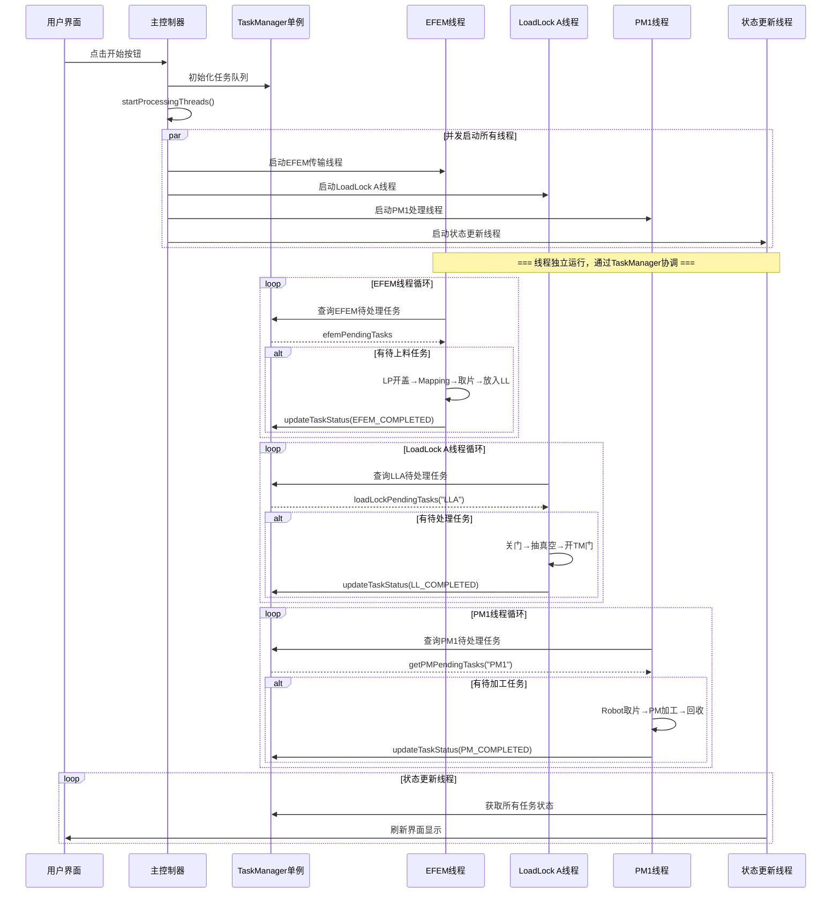

### 线程执行示例：EFEM传输线程

```cpp
// EFEM传输线程实际实现（简化版）
void QSlotTransferCycleVTMWidgetPrivate::executeEFEMTransfer() 
{
    while (!taskManager.isStopped()) {
        // 1. 从TaskManager获取待处理任务
        UpdateEfemSubTransferDatas();
        auto efemPendingTasks = taskManager.getEfemPendingTasks();
        
        if (efemPendingTasks.empty()) {
            std::this_thread::sleep_for(100ms);
            continue;
        }
        
        // 2. 处理上料任务（LP → LL）
        auto& task = efemPendingTasks[0];
        auto elp = (task.source == UnifiedWaferTask::LP1) ? elp1 : elp2;
        auto lk = (task.target == UnifiedWaferTask::LLA) ? lk1 : lk2;
        
        // 3. 执行上料步骤
        // Step 1: LP开盖
        auto cmdOpenBox = elp->createOpenBoxCommand();
        elp->startCommand(cmdOpenBox);
        cmdOpenBox->wait();
        
        // Step 2: Mapping检测晶圆
        auto cmdMapping = elp->createGetMapCommand();
        elp->startCommand(cmdMapping);
        cmdMapping->wait();
        
        // Step 3: Robot从LP取片
        auto cmdGet = ewtr->createGetCommand(elp, 1, task.sourceSlot);
        ewtr->startCommand(cmdGet);
        cmdGet->wait();
        
        // Step 4: (可选)Aligner对准
        if (需要对准) {
            auto cmdAlign = aligner->createAlignCommand();
            aligner->startCommand(cmdAlign);
            cmdAlign->wait();
        }
        
        // Step 5: Robot放片到LoadLock
        auto cmdPut = ewtr->createPutCommand(lk, 1, task.targetSlot);
        ewtr->startCommand(cmdPut);
        cmdPut->wait();
        
        // 4. 更新任务状态
        taskManager.updateTaskStatus(
            task.taskId,
            UnifiedWaferTask::EFEM_TRANSFER,
            UnifiedWaferTask::COMPLETED
        );
        
        // 5. 记录日志
        logInfo("EFEM", "上料完成: LP%d Slot%d -> LL%s Slot%d",
                task.source, task.sourceSlot,
                task.target == LLA ? "A" : "B", task.targetSlot);
    }
}
```

---

## 通信架构

### 通信层次结构

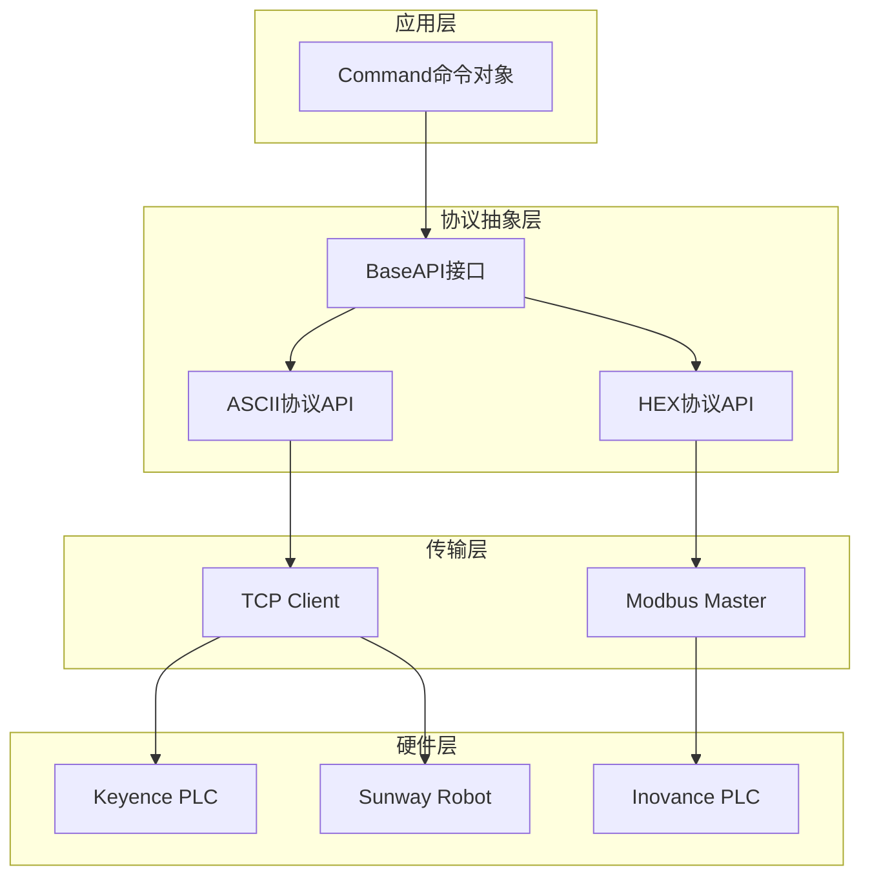

### Modbus通信机制

```cpp
// Modbus Master 核心职责
class ModbusMaster {
    功能:
    ├─ 建立TCP连接
    ├─ 读取寄存器
    │  ├─ 读保持寄存器（功能码0x03）
    │  └─ 读输入寄存器（功能码0x04）
    ├─ 写入寄存器
    │  ├─ 写单个寄存器（功能码0x06）
    │  └─ 写多个寄存器（功能码0x10）
    └─ 异常处理
};
```

### 设备通信地址映射

```
地址映射示例（LoadLock）
┌────────────────────────────────────────┐
│ 寄存器区域    │ 地址范围   │ 用途      │
├────────────────────────────────────────┤
│ 状态寄存器    │ 0-99      │ 设备状态   │
│ 控制寄存器    │ 100-199   │ 控制命令   │
│ 数据寄存器    │ 200-299   │ 工艺参数   │
│ 报警寄存器    │ 300-399   │ 错误代码   │
└────────────────────────────────────────┘
```

---

## UI组件体系

### MyUnit 自定义控件库

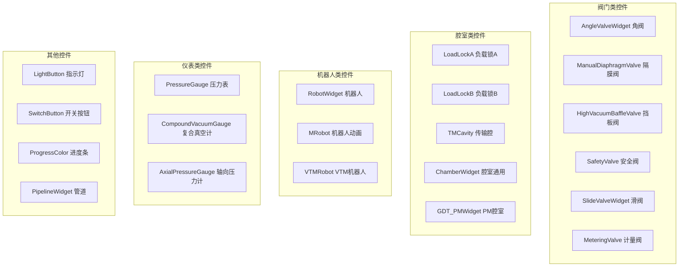

### 主界面组织结构

```
VTM主窗口
├─ 顶部工具栏
│  ├─ 系统控制按钮（启动/停止/复位）
│  ├─ 模式切换（手动/自动）
│  └─ 蜂鸣器/真空模式开关
│
├─ 主显示区
│  ├─ [状态监控] QFortrendStationStatusVTMWidget
│  │  ├─ LoadLock A/B 显示
│  │  ├─ Robot 动画显示
│  │  ├─ Aligner 显示
│  │  ├─ TM Cavity 显示
│  │  └─ PM1~PM6 Cavity 显示
│  │
│  ├─ [EFEM模块] TabWidget
│  │  ├─ LoadPort1 控制
│  │  ├─ LoadPort2 控制
│  │  └─ Aligner 控制
│  │
│  ├─ [手动控制] TabWidget
│  │  ├─ LoadLock 手动控制
│  │  ├─ Robot 手动控制
│  │  ├─ TM Cavity 手动控制
│  │  ├─ PM Cavity 手动控制
│  │  └─ Pump/Vacuum 控制
│  │
│  └─ [自动循环] TabWidget
│     ├─ 循环测试配置
│     ├─ 序列编辑器
│     └─ 执行监控
│
└─ 底部状态栏
   ├─ 报警信息显示
   ├─ 连接状态
   └─ 当前时间
```

### 状态监控界面布局

```
┌────────────────────────────────────────────────────────────┐
│                  VTM 状态监控主界面                         │
├────────────────────────────────────────────────────────────┤
│                                                             │
│  ┌─────────┐                              ┌──────────┐    │
│  │  LP1    │◄─────┐                   ┌──►│   PM1    │    │
│  └─────────┘      │                   │   └──────────┘    │
│                   │    ┌─────────┐    │   ┌──────────┐    │
│  ┌─────────┐      └────┤ LoadLock├────┘   │   PM2    │    │
│  │  LP2    │◄──────────┤   A     │◄────┐  └──────────┘    │
│  └─────────┘           └─────────┘     │  ┌──────────┐    │
│                                        │  │   PM3    │    │
│                        ┌─────────┐     │  └──────────┘    │
│  ┌─────────┐           │   TM    │◄────┤                  │
│  │ Aligner │◄──────────│ Cavity  │     │  ┌──────────┐    │
│  └─────────┘           └─────────┘     │  │   PM4    │    │
│                                        │  └──────────┘    │
│                        ┌─────────┐     │  ┌──────────┐    │
│                        │ LoadLock├─────┘  │   PM5    │    │
│                        │   B     │        └──────────┘    │
│                        └─────────┘        ┌──────────┐    │
│                                           │   PM6    │    │
│                                           └──────────┘    │
│                                                             │
│  ┌──────────────────────────────────────────────────────┐ │
│  │  Robot 动画区域（显示当前位置、手臂状态、动作）      │ │
│  └──────────────────────────────────────────────────────┘ │
│                                                             │
└────────────────────────────────────────────────────────────┘
```

---

## 关键业务流程

### 1. 完整自动传输流程

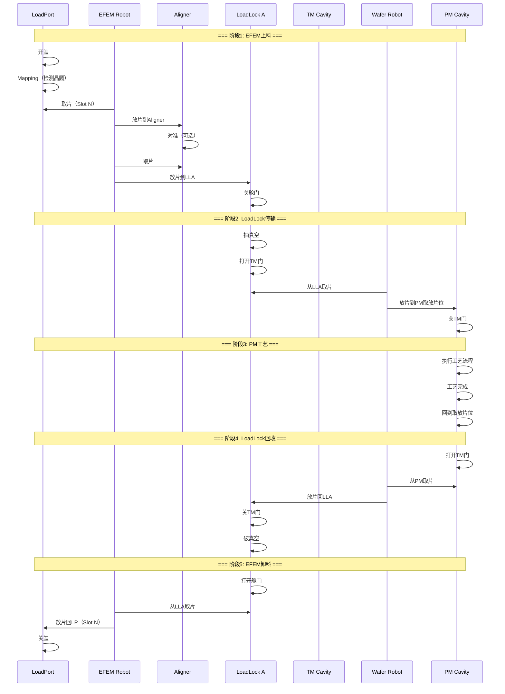

### 2. 双LoadLock并行处理流程

```mermaid
gantt
    title 双LoadLock并行传输时序图
    dateFormat  s
    axisFormat %S秒
    
    section LoadLock A
    EFEM上料        :a1, 0, 20s
    抽真空          :a2, after a1, 30s
    Robot取片→PM1   :a3, after a2, 15s
    PM1工艺         :a4, after a3, 60s
    Robot回收→LLA   :a5, after a4, 15s
    破真空          :a6, after a5, 20s
    EFEM卸料        :a7, after a6, 20s
    
    section LoadLock B
    等待            :b0, 0, 10s
    EFEM上料        :b1, after b0, 20s
    抽真空          :b2, after b1, 30s
    Robot取片→PM2   :b3, after b2, 15s
    PM2工艺         :b4, after b3, 60s
    Robot回收→LLB   :b5, after b4, 15s
    破真空          :b6, after b5, 20s
    EFEM卸料        :b7, after b6, 20s
    
    section Robot调度
    服务LLA上料     :r1, 20, 15s
    服务LLB上料     :r2, 40, 15s
    服务LLA回收     :r3, 95, 15s
    服务LLB回收     :r4, 115, 15s
```

### 3. 异常处理流程

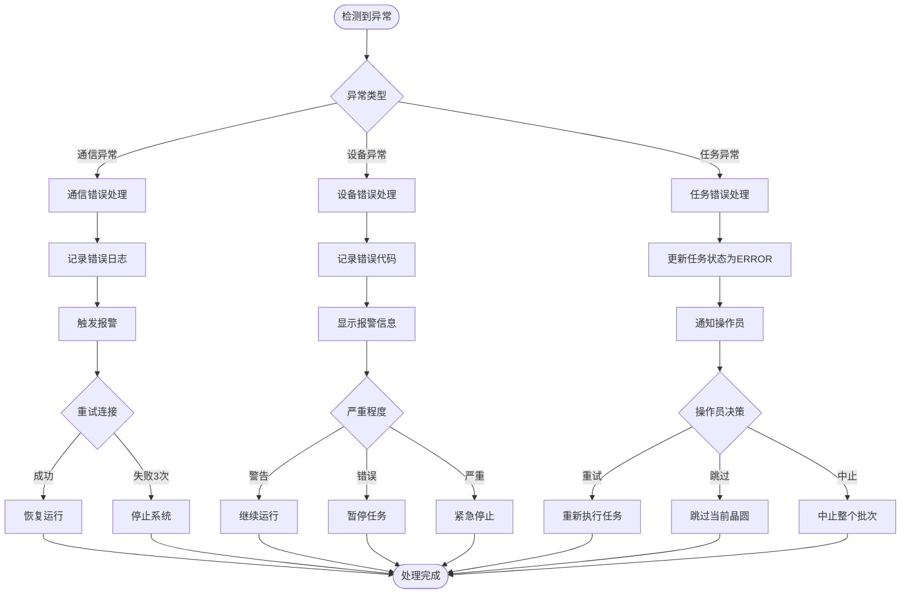

### 4. 系统初始化流程

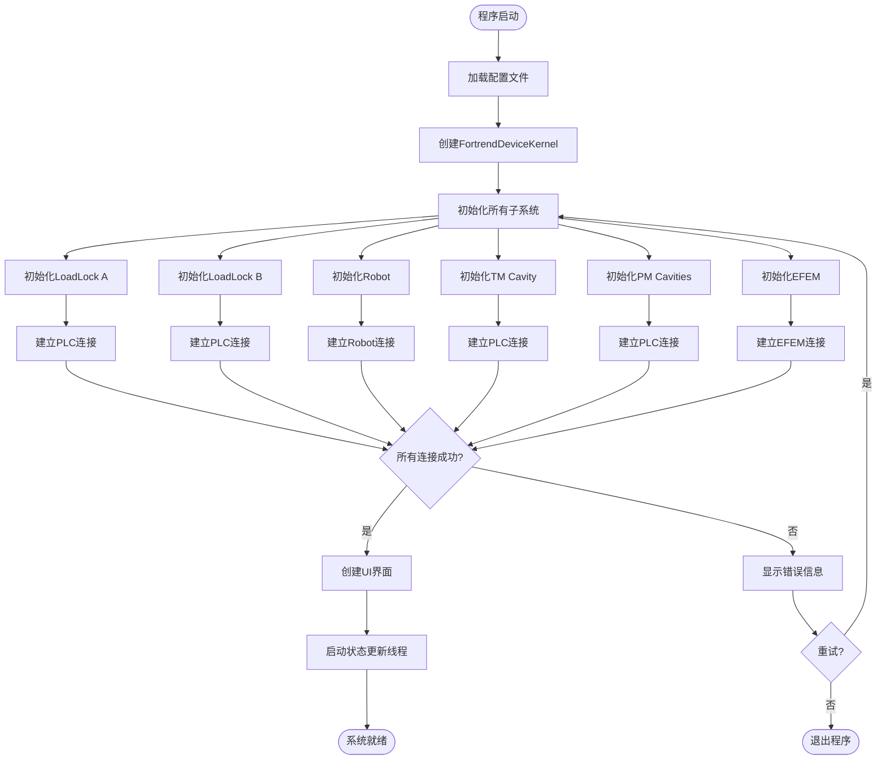

---

## 附录

### A. 关键文件索引

| 分类 | 文件路径 | 说明 |
|-----|---------|------|
| **核心内核** | `device/include/fortrend_device_kernel.h` | 设备内核定义 |
| | `device/include/fortrend_device_ui_model.h` | UI模型层 |
| **任务调度** | `device/include/TaskManager.h` | 任务管理器（单例模式） |
| | `device/include/UnifiedWaferTask.h` | 统一任务结构 |
| | `device/include/slot_transfer_cycle_vtm_widget.h` | 自动循环调度控制器 |
| | `device/src/slot_transfer_cycle_vtm_widget.cpp` | 多线程调度实现 |
| **子系统** | `device/include/LoadLock/fortrend_loadlock_subsystem.h` | LoadLock子系统 |
| | `device/include/SunwayRobot/fortrend_sunwayrobot_subsystem.h` | Robot子系统 |
| | `device/include/PMCavity/fortrend_pm_cavity_subsystem.h` | PM腔子系统 |
| | `device/include/TMCavity/fortrend_tm_cavity_subsystem.h` | TM腔子系统 |
| **UI组件** | `MyUnit/include/*.h` | 自定义控件库 |
| | `device/include/fortrend_station_status_vtm_widget.h` | 状态监控界面 |
| | `device/include/slot_transfer_auto_vtm_widget.h` | 自动传输界面 |
| **通信** | `device/include/modbus_master.h` | Modbus主站 |
| | `device/include/tcp_client_api.h` | TCP客户端 |
| **配置** | `config/config.ini` | 系统配置 |
| | `kernel.xml` | 设备配置 |

### B. 错误代码分类

```
错误代码分布：
├─ Error_Fortrend_LoadLock.txt       // LoadLock错误码
├─ Error_Fortrend_PM_Cavity.txt      // PM腔错误码
├─ Error_Fortrend_TM_Cavity.txt      // TM腔错误码
├─ Error_Sunway_Robot.txt            // 机器人错误码
├─ Error_Logosol_Aligner.txt         // 对准器错误码
├─ Error_KYKY_Molecular_Pump.txt     // 分子泵错误码
└─ Error_Fortrend_LP1/LP2.txt        // LoadPort错误码
```

### C. 编译部署

```bash
# 1. 安装依赖
# - Qt 5.x
# - Poco
# - Kernel框架
# - CMake 3.0+
# - Visual Studio 2013

# 2. 生成项目
cd d:/HLPrj/HL
mkdir build
cd build
cmake .. -G "Visual Studio 12 2013"

# 3. 编译
cmake --build . --config Release

# 4. 运行
cd output/Release
VTM.exe
```

### D. 学习路径建议

作为学习C#和WPF的参考，本Qt项目提供以下对照学习点：

| Qt概念 | WPF/C#对应概念 | 说明 |
|--------|---------------|------|
| QObject信号槽 | 事件/委托 | 观察者模式实现 |
| QWidget | UserControl/Control | UI控件基类 |
| paintEvent() | OnRender() | 自定义绘制 |
| QThread | Task/Thread | 多线程 |
| Qt属性系统 | 依赖属性 | 数据绑定基础 |
| QML（无） | XAML | 声明式UI |
| Model/View | MVVM | 架构模式 |

**学习建议**：

1. **对比架构**：本项目使用MVC变体，WPF推荐MVVM，理解数据流向差异
2. **控件开发**：学习MyUnit库如何自定义绘制，对应WPF的CustomControl
3. **多线程调度**：观察QSlotTransferCycleVTMWidget的9个并发线程，对应WPF的Task/async-await模式
4. **命令模式**：*Command类族对应WPF的ICommand
5. **数据绑定**：Qt手动连接信号槽，WPF使用Binding自动绑定
6. **任务管理**：TaskManager单例模式对应WPF的ViewModel中的ObservableCollection<T>

---

## 总结

本VTM项目展示了一个**工业级半导体设备控制系统**的完整架构，核心特点：

✅ **模块化分层**：清晰的表现层、业务层、设备层、通信层分离  
✅ **任务调度**：TaskManager单例 + 状态机实现复杂的晶圆迁移流程  
✅ **并发控制**：线程安全设计，支持双LoadLock并行  
✅ **可扩展性**：命令模式+工厂模式，易于添加新设备  
✅ **可视化**：丰富的自定义UI控件库，直观的动画反馈  
✅ **健壮性**：完善的异常处理和错误代码系统  

**对学习的价值**：
- 理解工业软件的复杂度管理方法
- 学习状态机驱动的业务流程设计
- 掌握Qt/C++与WPF/C#的架构映射关系
- 体会软件工程实践（模块化、设计模式、文档化）

---

**文档版本**: 1.0  
**创建日期**: 2025-10-14  
**适用项目**: VTM真空传输模块控制系统  
**维护者**: 项目开发团队
