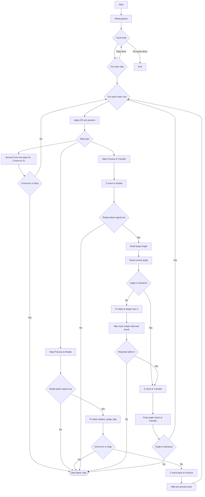

# PM Spindle 运动逻辑说明（售后）

## 1. 目的与适用范围

本文用于说明 PM 腔 Spindle（PM 腔 Z/R 两轴）在“PM 配方测试界面”运行时的运动逻辑与关键互锁条件，便于售后人员理解：

- Spindle 的 4 个标准高度位置（Transfer/LiftPin/Rotate/Process）的含义
- 配方步骤（From/To）的执行顺序与动作组成
- 旋转位互锁与“取放片前必须到指定角度”的实现方式
- 常见异常/停止行为

对应代码入口：`QPmRecipeWidget::startPmMotorRun()`（PM 配方运行线程）  
文件位置：[pm_recipe_widget.cpp](file:///d:/HLPrj/HL/device/src/pm_recipe_widget.cpp)

## 2. 轴与位置定义

### 2.1 轴

- Z 轴：升降定位（高度）
- R 轴：旋转定位（角度）

### 2.2 标准位置（高度）

系统在运行前会从界面参数读取以下 4 个高度，并在运行线程中映射为 `posMap`：

- Transfer：取放片高度（`take_position_mm`）
- LiftPin：顶针高度（`lift_pin_position_mm`）
- Rotate：旋转高度（`rotate_position_mm`）
- Process：工艺高度（`process_position_mm`）

说明：

- 旋转动作只允许在 Rotate（旋转位）执行
- Process 相关的工艺等待时间，仅在满足特定步骤条件时执行

## 3. 配方运行结构（售后视角）

运行逻辑是“循环（Cycle）→ 步骤序列（Sequence Steps）→ 内表列（Motor Row）”三层嵌套：

1. Cycle：界面设置循环次数（默认至少 1 次）
2. Sequence Steps：外表每行一条 `From -> To (RecipeName)`
3. Motor Row：内表每列一组电机参数（加减速、速度、Wait 等），同一条 Step 会按内表列数执行多次

每一次 Motor Row 执行时，会：

1. 下发本列的 Z/R 轴参数（加速度、减速度、Jerk、速度）
2. 按当前 Step 的规则执行 Z 轴移动、R 轴旋转、以及等待时间
3. 发现错误或收到 Stop 请求时立即中止

## 4. 动作规则（核心逻辑）

### 4.1 标准 Z 轴定位（一般步骤）

当 `From != To` 且不是 `Process -> Transfer` 特例时：

- 直接执行一次 Z 轴定位到 `To` 对应的高度（同步等待命令完成）
- 若命令报错或 Stop 被触发，则该步骤失败并停止后续动作

### 4.2 Process -> Rotate（工艺循环触发步骤）

当步骤为 `Process -> Rotate` 时，会发生两类动作：

1. 到达 Rotate 后执行一次 R 轴旋转（旋转角度来自界面参数 `rotation_angle_deg`）
2. 旋转完成后，Z 轴再回到 Process 高度（保证后续工艺等待在 Process 面执行）

随后才进入“工艺等待时间”逻辑：

- 前处理 Wait（`pre_process_wait_s`）
- 工艺时间 Wait（总时间按次数分配，最后一次可单独配置 `last_process_time_s`）
- 后处理 Wait（`post_process_wait_s`）

### 4.3 Process -> Transfer（取放片前角度互锁，重点）

当步骤为 `Process -> Transfer` 时，为满足“取放片前必须到达指定角度（lift pin 角度 IO）”，逻辑被拆分为两段 Z 定位，并在旋转位插入角度互锁：

1. Z 轴先定位到 Rotate（旋转位）
2. 旋转位互锁检查：必须确认已经到旋转位（旋转位到位信号为真），否则报错并停止
3. 读取目标角度：使用 PLC 提供的“安全角度/指定角度”作为目标值（`getPmLiftPinSafeAnglePos()`）
4. 读取当前角度：使用 R 轴当前坐标 IO（`getPMCavityRAxleLocation()`）
5. 若当前角度不满足目标角度（按容差判断），则在 Rotate 位执行旋转命令并重试校验：
   - 每次旋转命令完成后，立刻再次读取 `getPMCavityRAxleLocation()` 校验
   - 未到位则继续旋转，最多尝试 3 次
   - 3 次仍未到位：报错并停止所有动作
6. 角度满足后，Z 轴再下降到 Transfer（取放片位）
7. 在 Transfer 位进行最终角度校验：再次读取 `getPMCavityRAxleLocation()` 与目标角度对比，不满足则报错并停止

容差策略：

- 当前实现使用固定角度容差 `1.0°`（即 `|current - target| <= 1.0` 视为到位）
- 若现场需要更严格或更宽松，可由研发调整该容差参数

### 4.4 流程图（售后快速理解）

## 5. 关键互锁/信号说明

### 5.1 旋转位到位信号（R 轴允许旋转的前置）

R 轴旋转命令会强制要求“Z 轴在旋转位”，否则会拒绝执行并报错。

- 用途：防止在非旋转位旋转造成机构干涉
- 体现：`Process -> Rotate` 与 `Process -> Transfer` 都会依赖该信号

### 5.2 目标角度来源（lift pin 角度 IO）

目标角度不是写死值，而是来自 PLC 的“安全角度/指定角度”信号（用于确保取放片姿态满足 lift pin 条件）。

### 5.3 当前角度来源（R 轴当前坐标 IO）

最终到位判定使用 PLC 的“旋转轴当前坐标”读数作为标准，避免只依赖命令完成位而出现角度偏差。

## 6. 停止与异常行为（售后关注点）

- 任一动作命令报错（Z 定位失败、R 旋转失败、互锁信号不满足、角度重试失败、最终角度校验失败）：
  - 当前 Step 标记失败
  - 后续动作不再执行
- Stop 按钮触发（StopRequested）：
  - 线程在各等待点/动作完成点尽快退出
  - 不再执行后续步骤

## 7. 常见现象与排查建议（快速）

- 现象：提示“未在旋转位停止旋转/旋转位信号为假”
  - 重点检查：旋转位到位信号是否正常、Z 轴是否确实在 Rotate 高度
- 现象：反复旋转仍提示角度未到位（最多 3 次后报错）
  - 重点检查：目标角度 IO 是否变化合理、R 轴当前位置 IO 是否稳定刷新、旋转机构是否打滑/失步
- 现象：能旋转但在 Transfer 位最终角度校验失败
  - 重点检查：下降过程中角度是否发生漂移、R 轴保持/抱闸状态是否可靠
