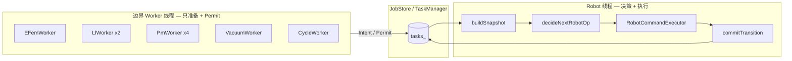

# SchedulerV2 重构方案 — 对照 SchedulerSkills 与严重问题

> **依据**  
> - 约束： [`.trae/skills/SchedulerSkills.md`](../../.trae/skills/SchedulerSkills.md)  
> - 问题： [`目前调度问题.md`](../../目前调度问题.md)  
> - 现状：`device/src/slot_transfer_cycle_vtm_widget.cpp`、`TaskManager.cpp`、`UnifiedWaferTask.h`  
>
> **本文**：只出设计与文件边界，**不改业务代码**。重点解决 **决策分散（A-06）** 与 SchedulerSkills **「WTR 全局决策、边界只做闸门」** 的差距。

---

## 1. 核心差距：执行已集中，决策未集中

SchedulerSkills 要求的是两层分离：

| 层级 | 职责 | 老项目正确做法 | SchedulerV2 现状 |
|------|------|----------------|------------------|
| **执行层** | 唯一线程下发 WTR 命令 | `startRobotAction` | ✅ `executeTMTransfer` |
| **决策层** | 在**同一时刻快照**上决定下一条 WTR 动作（取/放/交换/哪只手/先做谁） | 老版在 Robot `case 1010/4001` 读 PM+手臂 | ❌ PM2 `case 200`、`shouldLlWaitForPm2Priority`、`isRobotArmOccupiedForLlRequest`、PM 发请求前分支 |

当前 V2 **只把「命令执行」集中到了 Robot 线程**，却把 **「该不该做、做哪一种、用哪只手」** 留在了 PM/LL 线程。这与 Skills §1.1（边界不做全局执行器决策）、§2.4（WTR 是全局仲裁者）直接冲突。

```text
【现状 — 决策分散】

  LL 线程                         PM2 线程                    Robot 线程
  ├─ shouldLlWaitForPm2Priority   ├─ case 200: 放/取/交换?     ├─ case 10: 仅扫描 requested
  ├─ isRobotArmOccupied...         ├─ arm1HasPending 兜底       ├─ 不读全局 pending 竞争
  ├─ 1051: 选 targetArm           ├─ 1060/1070: 定 exchange arm └─ 执行已被点的请求
  └─ expedited / ImmediateRepick  └─ syncPm2ReturnTaskArm 补丁

【目标 — 决策集中】

  LL / PM / EFEM 线程              SchedulerCore (Robot 线程内或同模块)
  ├─ 真空/门阀/移槽/工艺位          ├─ buildSnapshot() 一次采集
  ├─ 上报 Permit: "我准备好了"      ├─ decideNextRobotOp(snapshot) 唯一出口
  └─ 不判断 PM2 优先、不判双臂策略    └─ executeRobotOp() → 完成后 commitTransition()
```

---

## 2. 严重问题 × SchedulerSkills 对照矩阵

| 严重级 | 问题 ID | SchedulerSkills 条款 | 差距说明 | 重构归属模块 |
|--------|---------|----------------------|----------|--------------|
| **P0** | A-06, S-05, D-01 | §1.1 边界不做全局决策；§2.4 WTR 全局仲裁 | PM2/LL 前置决策导致 `10↔200↔1051` 僵死 | `scheduler/RobotScheduler.cpp` |
| **P0** | A-01, S-09, T-08 | §1.6 队列+标志双通道 | 三轨状态、本地 vector 与 TaskManager 双写 | `scheduler/SchedulerSnapshot.cpp` + `job/JobStore.cpp` |
| **P0** | T-01~T-06 | §3.2 队列竞争、线程安全 | TaskManager 无锁/UB 接口 | `job/TaskManager.cpp`（修） |
| **P0** | S-04, S-03, R-03 | §1.3 阶段提交；§2.2 队列契约 | 交换/回片/补取非事务；`arm` 混用 | `job/TransitionCommit.cpp` |
| **P1** | S-06, E-01 | §1.1 边界拆分 | LLA/LLB、PM1~4 复制状态机 | `workers/LlWorker.cpp`、`workers/PmWorker.cpp` |
| **P1** | S-07, E-02 | §2.4 统一决策 | expedited + ImmediateRepick 双结构 | 并入 `RobotOp` + `decideNextRobotOp` |
| **P1** | A-04, A-05 | §1.6 双通道 | 遗留 bool + PM 不对称 | `scheduler/GateRegistry.cpp` |
| **P2** | E-03, D-08 | §2.4 优先级 | case 10 硬编码优先级 | `scheduler/PriorityPolicy.h` |
| **P2** | E-07, A-02 | 模块化 | 万行 Widget | 目录拆分（见 §4） |
| 归档 | R-01 | — | 固件 RPS 提前 success | 硬件层，调度仅防御 |

---

## 3. 决策集中化：迁出 / 保留清单

### 3.1 必须从 PM2 `case 200` **迁出** 到 Robot 决策层的逻辑

| 现状位置 | 现在在做什么 | 迁到 |
|----------|--------------|------|
| `executePM2Transfer` `case 200` | 读 `haswaferpm`、`hasObject(0/1)`、`pm2Pending/Completed/Return` | `SchedulerSnapshot` 字段 |
| 同上 | 分支：无片→1010/1030 放；有片双手空→1040/1050 取；有片+pending→1060/1070 交换 | `decideNextRobotOp()` 返回 `PutPm`/`GetPm`/`ExchangePm` |
| 同上 | `arm1HasPending/arm2HasPending` 及物理持片兜底 | `PendingMatcher`（快照内一次算清） |
| 同上 | `pm2_exchange_in_flight` 与是否发 exchange | `RobotOpQueue` 单一 in-flight |
| `syncPm2ReturnTaskArm` | 交换后修正 return 任务的 arm | `commitTransition(AfterExchange)` 单点写 |

**PM2 线程重构后只保留**：

- PM 在取放位 / 工艺位（`createToGetStation` / `createToPutStation`）
- 工艺循环（`createToPutStation` 工艺步）
- 上报 `PmPermit::AtLoadUnloadStation`（等价 `pm2_allow_get_put_wafer`，但**不再**决定放/取/交换）

### 3.2 必须从 LL `1051/2066` **迁出** 的逻辑

| 现状位置 | 现在在做什么 | 迁到 |
|----------|--------------|------|
| `shouldLlWaitForPm2Priority` | LL 侧猜测 PM2 是否应优先 | `decideNextRobotOp`：全局排序，LL 取片请求仅入队 |
| `isRobotArmOccupiedForLlRequest` | LL 发请求前查 14 个 request + `robot_step` | Robot 决策时统一 `ArmReservation`；LL 只申报「欲取 taskId+偏好手」 |
| `1051` 内 `targetArm` 切换、`updateTaskArm` | LL 决定实际手 | 决策层输出 `runtimeArm`；LL 只执行闸门（真空、开门、slot） |
| `llaImmediateRepick` + `expedited` | 双结构记补取 | 单一 `RobotOp::GetFromLl { expedited, taskId }` |

**LL 线程重构后只保留**：

- 破/抽真空、mapping、移槽、TM 门
- `tool_allow_get/put_wafer`（对 EFEM 握手，可逐步改为 `EfemPermit`）
- 当 TaskManager 存在 `LOADLOCK_TRANSFER/QUEUED` 且本地 Permit 满足时，向 **`RobotRequestQueue` 提交** `GetFromLl` 意图（**不**在 1051 阻塞等 PM2）

### 3.3 保留在 `executeTMTransfer` 但需升级的部分

| 保留 | 升级方式 |
|------|----------|
| `case 10` 优先级扫描 | 改为 `decideNextRobotOp` 输出唯一 `RobotOp`，优先级表可配置 |
| `case 1000~5300` 硬件命令 | 下沉为 `RobotCommandExecutor`，只接收已决策的 `RobotOp` |
| 交换片连续 get+put | 保留在执行层，但 **op 类型** 由决策层一次给定 |

### 3.4 明确禁止（重构后 Code Review 红线）

- ❌ PM 线程内根据 `wtr->hasObject` + pending 列表决定 `pm2_auto_step` 走向 1010/1060
- ❌ LL 线程内调用 `shouldLlWaitForPm2Priority` / `isRobotArmOccupiedForLlRequest` 决定是否 `requested=true`
- ❌ 业务线程内 `updateTaskArm` 与本地 `loadLockAPendingTasks.at(0).arm` 双写而不经 `commitTransition`

---

## 4. 目标目录与文件职责（重构文件树）

建议在 `device/` 下新增调度包，与 UI Widget 解耦：

```text
device/
├── include/
│   └── scheduler/
│       ├── SchedulerTypes.h          // RobotOp, Permit, Snapshot, Phase
│       ├── SchedulerSnapshot.h       // 一次采集所有决策输入
│       ├── IRobotScheduler.h         // decideNextRobotOp / execute / commit
│       ├── RobotScheduler.h
│       ├── GateRegistry.h            // 替代零散 tool_allow_* / pm*_allow_*
│       ├── PriorityPolicy.h          // WTR 全局优先级（原 case 10）
│       └── workers/
│           ├── ILlWorker.h           // 仅 LL 硬件闸门 + 提交意图
│           ├── IPmWorker.h           // 仅 PM 转位 + 工艺
│           └── IEfemWorker.h
├── src/
│   └── scheduler/
│       ├── SchedulerSnapshot.cpp     // buildSnapshot: WTR/PM/LL/TaskManager
│       ├── RobotScheduler.cpp        // ★ decideNextRobotOp + executeTMTransfer 瘦身
│       ├── RobotCommandExecutor.cpp  // createGet/Put, 无分支决策
│       ├── TransitionCommit.cpp      // ★ 动作成功后单点 updateTaskStatus/updateArm
│       ├── GateRegistry.cpp
│       ├── PriorityPolicy.cpp
│       └── workers/
│           ├── LlWorker.cpp          // 合并 LLA/LLB，参数化 LLName
│           ├── PmWorker.cpp          // 合并 PM1~4，PM2 特殊策略进 Policy 而非 case 200
│           └── EfemWorker.cpp
├── src/
│   └── job/
│       ├── TaskManager.cpp           // 修线程安全；瘦身查询 API
│       ├── JobStore.cpp              // 对 Widget 暴露只读视图
│       └── WaferLifecycle.h          // 阶段枚举，替代 taskType 覆盖语义
└── src/
    └── slot_transfer_cycle_vtm_widget.cpp   // 仅 UI、启停、装配各 Worker 线程
```

**关键文件说明**：

| 文件 | 职责 | 对应 Skills |
|------|------|-------------|
| `SchedulerSnapshot.cpp` | 锁内/短临界区采集：TM 真空、各 PM mapping、WTR 双臂、TaskManager 各阶段队列 | 消灭 A-01「非同一时刻快照」 |
| `RobotScheduler.cpp` | **`decideNextRobotOp(snapshot)` 唯一决策出口**；原 PM2 case 200 + LL 1051 策略全部迁入 | §2.4 WTR 全局仲裁 |
| `RobotCommandExecutor.cpp` | 执行 `RobotOp`，wait 命令，返回成功/失败 | §1.2 执行串行 |
| `TransitionCommit.cpp` | 成功后一次性：task 阶段迁移、`runtimeArm`、`LOADLOCK_RETURN` 登记 | §1.3 阶段提交 |
| `LlWorker.cpp` | 真空/门阀；满足 guard 则 `queue.push(GetFromLlIntent)` | §1.1 边界闸门 |
| `PmWorker.cpp` | 转位/工艺；`queue.push` 仅当决策层已下发 Put 需求… **改为** PM 只报告 AtStation | §1.1 |
| `GateRegistry.cpp` | `EfemPermit`/`LlPermit`/`PmPermit` 统一置位/清位 | §1.6 双通道 |

---

## 5. 决策集中：核心 API 草图（设计用）

```cpp
// SchedulerTypes.h — 决策输出（Robot 线程消费）
enum class RobotOpKind {
    None,
    GetFromLl, PutToLl, GetFromPm, PutToPm, ExchangePm,
};

struct RobotOp {
    RobotOpKind kind;
    int taskId;
    int arm;              // runtimeArm，决策层输出
    int slot;
    std::string llName;   // LLA / LLB
    std::string pmName;   // PM1..PM4
    int exchangeGetArm;   // ExchangePm 专用
    int exchangePutArm;
    bool expedited;
};

// SchedulerSnapshot.h — 决策输入（只读，一次构建）
struct SchedulerSnapshot {
    // 硬件
    bool tmVacuumOk;
    bool pmHasWafer[4];
    bool armHasWafer[2];
    bool wtrBusy;
    // 任务视图（来自 JobStore，非线程本地 vector）
    std::vector<WaferJobView> pmPending[4];
    std::vector<WaferJobView> pmCompleted[4];
    std::vector<WaferJobView> llTransferPending[2];
    std::vector<WaferJobView> llReturnPending[2];
    // 已排队未执行的意图（替代 14 个 requested 散落判断）
    std::optional<RobotOp> inFlight;
    std::vector<RobotOpIntent> pendingIntents;
};

// RobotScheduler.h
class RobotScheduler {
public:
    RobotOp decideNext(const SchedulerSnapshot& s);  // ★ 唯一决策函数
    void execute(const RobotOp& op);                   // 仅执行
    void commit(const RobotOp& op, bool success);      // 仅提交状态
};
```

**`decideNext` 合并的原逻辑（迁移对照表）**：

| 原函数/分支 | 并入 `decideNext` 的规则块 |
|-------------|---------------------------|
| `executeTMTransfer case 10` 优先级 | `PriorityPolicy::rank(op)` |
| PM2 `case 200` 放/取/交换 | `resolvePmInteraction(pmIndex, snapshot)` |
| `shouldLlWaitForPm2Priority` | **删除**；改为全局 `compare(LL_GET vs PM_GET)` |
| `isRobotArmOccupiedForLlRequest` | **删除**；改为 `snapshot.inFlight` + `armReservation` |
| PM2 物理持片兜底 | `matchPendingToPhysicalArm(snapshot)` |

---

## 6. 分阶段实施路线（对齐 P0/P1）

### Phase 0 — 地基（不改决策，先消除 UB）

| 步骤 | 内容 | 关闭问题 |
|------|------|----------|
| 0.1 | `TaskManager` 全 API 加锁；禁止返回内部引用；修 `getByIDFindTask` | T-01~T-06 |
| 0.2 | Widget 内禁止直接改 `loadLock*PendingTasks.arm`，只经 TaskManager | T-08, S-09 |
| 0.3 | 引入 `plannedArm` / `runtimeArm` 字段（或扩展 UnifiedWaferTask） | S-03 |

### Phase 1 — 快照 + 决策单点（核心）

| 步骤 | 内容 | 关闭问题 |
|------|------|----------|
| 1.1 | 实现 `buildSnapshot()`，Robot 线程每周期调用一次 | A-01 |
| 1.2 | 将 PM2 `case 200` **整段**改为调用 `decideNext`；PM 线程只保留转位/工艺 | **A-06, S-05, D-01** |
| 1.3 | 删除 LL 内 `shouldLlWaitForPm2Priority`；LL 仅 `submitIntent(GetFromLl)` | **A-06, D-01** |
| 1.4 | `commitTransition` 接管 `syncPm2ReturnTaskArm`、立即补取 arm 更新 | S-04, S-07 |
| 1.5 | `executeTMTransfer` 瘦身为：`snap → op → execute → commit` 循环 | S-01（Robot 侧） |

### Phase 2 — Worker 合并与 Gate 统一

| 步骤 | 内容 | 关闭问题 |
|------|------|----------|
| 2.1 | `LlWorker` 参数化 LLA/LLB，删除重复 case | S-06, E-01 |
| 2.2 | `PmWorker` 参数化 PM1~4，PM2 特殊进 Policy | A-05, E-01 |
| 2.3 | `GateRegistry` 替代 `tool_allow_*` / `pm*_allow_*` 海 | A-04 |
| 2.4 | Robot 请求矩阵改为 `RobotRequestQueue`（动态，非 14 静态变量） | E-02 |

### Phase 3 — Widget 瘦身与可配置优先级

| 步骤 | 内容 | 关闭问题 |
|------|------|----------|
| 3.1 | `slot_transfer_cycle_vtm_widget.cpp` 仅保留 UI/启停 | E-07, A-02 |
| 3.2 | `PriorityPolicy` 配置化（INI/表格） | E-03, D-08 |

---

## 7. 线程模型（重构后 vs SchedulerSkills）



与 Skills 对齐点：

- ✅ WTR 命令仍在单线程（`RobotCommandExecutor`）
- ✅ 业务线程不再「预判 WTR 做什么」
- ✅ 队列（JobStore）与执行权（GateRegistry + inFlight）分离
- ✅ Update 仍在 `CycleWorker`，不掺入取放决策

---

## 8. 验收标准（决策集中专项）

重构 Phase 1 完成后，应满足：

1. **全仓库 grep** 无 `shouldLlWaitForPm2Priority`、无 PM `case 200` 内 `haswaferarm` 分支（可保留日志用快照字段）。
2. LL `1051` 仅：检查本地 Permit → `submitIntent` → 等待 `commit` 通知；**无** PM2 优先判断。
3. 任意时刻日志可打印一行：`decideNext => ExchangePm PM2 getArm=0 putArm=1 taskId=7`，作为排障单点。
4. 跑片场景回归：交换片 → 回 LL → 立即补取，**不再**需要 `syncPm2ReturnTaskArm` 类补丁（逻辑在 `commitTransition`）。
5. SchedulerSkills §6 对照表「决策集中在 Robot」由 ❌ 变为 ✅。

---

## 9. 与《目前调度问题.md》的索引

| 问题 ID | 本方案章节 |
|---------|------------|
| A-06, S-05, D-01 | §1、§3、§5、§8 |
| A-01, S-09, T-08 | §4 `SchedulerSnapshot` + Phase 0 |
| T-01~T-06 | §6 Phase 0 |
| S-04, S-07, S-03 | §3.3 `TransitionCommit` |
| S-06, E-01 | §4 `LlWorker` / `PmWorker` |
| A-04, E-02 | §4 `GateRegistry` / `RobotRequestQueue` |

---

## 10. 总结

SchedulerV2 已做对 **WTR 执行单线程**，但未做对 **WTR 决策单线程（同一快照、同一函数）**。严重跑片问题（PM2↔LL 僵死、错手、交换后回片窗口）本质是 **违反 SchedulerSkills 的边界原则**：PM/LL 在替 Robot 做全局仲裁。

重构的**第一优先级**不是再加补丁，而是：

1. 新增 `SchedulerSnapshot` + `decideNextRobotOp`（`device/src/scheduler/RobotScheduler.cpp`）  
2. **掏空** PM2 `case 200` 与 LL `1051` 中的决策分支  
3. 用 `commitTransition` 保证阶段与 `runtimeArm` 事务一致  

其余模块（TaskManager 线程安全、Worker 合并）可在 Phase 0/2 并行，但**决策集中**应作为 SchedulerV2 重构的「主心骨」。

---

*文档版本：2026-06-02 · 仅设计，不修改 `slot_transfer_cycle_vtm_widget.cpp` 实现。*
