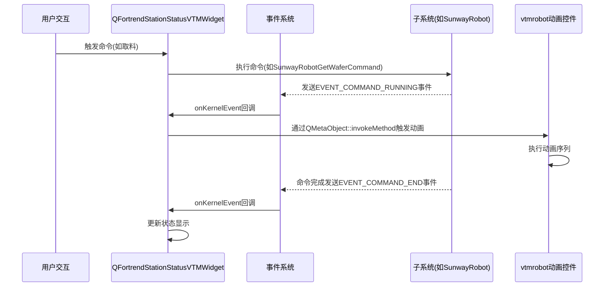
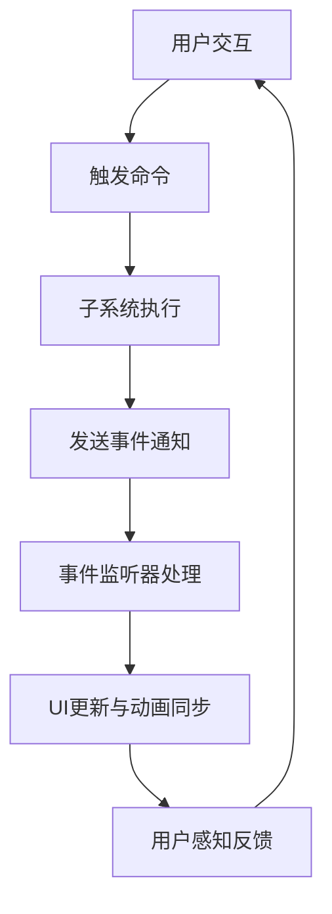

# VTM系统工作流程与联动机制分析

## 1. 系统架构概述

VTM（真空转移模块）系统采用基于Qt框架的模块化架构设计，结合事件驱动和信号槽机制实现各组件间的协同工作。系统主要由以下几个核心部分组成：

- **Kernel核心**：提供事件总线、模块管理和通信基础
- **子系统模块**：如LoadLock、SunwayRobot、PMCavity等功能模组
- **UI控件层**：包括机械手动画控件、阀门控件、状态显示等
- **事件监听机制**：实现系统状态变化的实时响应

## 2. 事件系统与联动机制

### 2.1 事件系统架构

事件系统基于`KernelEventListener`接口实现，该接口定义了事件处理的核心方法：

```cpp
virtual void onKernelEvent(KernelEventModule*, const IEventId::Ptr&, KernelEventParameter*) = 0;
```

系统预定义了多种事件类型，如`EVENT_COMMAND_START`、`EVENT_COMMAND_END`、`EVENT_ALARM_CREATE`等，用于标识不同的系统状态变化。

### 2.2 事件监听与注册机制

核心UI类`QFortrendStationStatusVTMWidgetPrivate`通过多继承实现了事件监听能力：

```cpp
class QFortrendStationStatusVTMWidgetPrivate : public KernelListener<KernelAbstractSubSystem>, 
                                              public FC::KernelEventListener, 
                                              public FC::KernelListener<FC::Cassette>,
                                              public FC::KernelListener<FC::FortrendCassetteManager>
```

在构造函数中，该类将自身注册为多个子系统的事件监听器：

```cpp
lk1->addEventListener(this);
lk2->addEventListener(this);
pm1->addEventListener(this);
pm2->addEventListener(this);
tm->addEventListener(this);
wtr->addEventListener(this);
```

## 3. 核心工作流程

### 3.1 命令执行与动画联动流程



### 3.2 错误处理与动画控制流程

```mermaid
flowchart TD
    A[系统产生警报] --> B[发送EVENT_ALARM_CREATE事件]
    B --> C[QFortrendStationStatusVTMWidgetPrivate::onKernelEvent]
    C --> D[调用robot_widget->animationPause()]
    D --> E[机械臂动画暂停]
    
    F[系统状态恢复] --> G[发送EVENT_STATE_CHANGED事件]
    G --> H[QFortrendStationStatusVTMWidgetPrivate::onKernelEvent]
    H --> I[调用robot_widget->animationResume()]
    I --> J[机械臂动画恢复]
```

## 4. 关键类调用顺序

### 4.1 初始化流程

1. **QFortrendStationStatusVTMWidget构造函数**：创建UI界面
2. **QFortrendStationStatusVTMWidgetPrivate构造函数**：
   - 获取各子系统实例
   - 注册事件监听器
   - 初始化UI组件和配置
3. **各子系统对象初始化**：如LoadLock、Robot、PM等

### 4.2 事件处理流程

1. **事件触发**：子系统在特定条件下发送事件
2. **事件分发**：KernelEventModule::sendEvent将事件分发给所有注册的监听器
3. **事件处理**：QFortrendStationStatusVTMWidgetPrivate::onKernelEvent根据事件类型执行相应逻辑：
   ```cpp
   void QFortrendStationStatusVTMWidgetPrivate::onKernelEvent(FC::KernelEventModule* kernelModule, 
                                                         const std::shared_ptr<FC::IEventId>& eventId, 
                                                         FC::KernelEventParameter* context){
       // 根据事件类型处理
       if (std::dynamic_pointer_cast<EVENT_ALARM_CREATE>(eventId)) {
           // 处理警报事件
       }
       else if (std::dynamic_pointer_cast<EVENT_COMMAND_END>(eventId)) {
           // 处理命令完成事件
       }
       // ... 其他事件类型处理
   }
   ```

4. **UI更新**：使用QMetaObject::invokeMethod确保在UI线程中安全更新界面

### 4.3 动画控制流程

1. **动画触发**：通过QMetaObject::invokeMethod调用Animation槽函数
2. **动画参数设置**：设置工位、手臂和动作类型
3. **动画执行**：
   - vtmrobot类使用QPropertyAnimation控制动画
   - 手臂伸缩、旋转和晶圆状态切换动画序列
   - 根据速度参数调整动画持续时间

## 5. 组件交互详情

### 5.1 QFortrendStationStatusVTMWidget与子系统交互

- **命令发送**：向子系统发送控制命令
- **状态获取**：定期获取子系统状态
- **事件监听**：接收子系统事件通知

### 5.2 vtmrobot控件功能

- **动画控制**：手臂伸缩、旋转和晶圆状态切换
- **事件处理**：右键菜单触发控制、复位、状态获取等操作
- **属性设置**：设置旋转角度、速度参数、当前工位等

### 5.3 属性变更监听机制

除事件监听外，系统还实现了属性变更监听：

```cpp
void QFortrendStationStatusVTMWidgetPrivate::onAttributeChange(const KernelAbstractSubSystem* arg){
    if (wtr->getRunningStatus() == "pause") {
        ui->robot_widget->animationPause();
    }
    else if (wtr->getRunningStatus() == "normal") {
        ui->robot_widget->animationResume();
    }
    else if (wtr->getRunningStatus() == "abort") {
        ui->robot_widget->animationAbort();
    }
}
```

## 6. 技术要点总结

1. **多继承与接口实现**：通过多继承实现多种监听器接口，实现全方位系统监控
2. **Qt元对象系统**：利用QMetaObject::invokeMethod实现线程安全的UI更新
3. **事件驱动架构**：基于事件总线的组件通信，降低模块耦合度
4. **观察者模式**：事件监听器注册与通知机制
5. **状态同步**：通过事件和属性变更确保UI与系统状态实时同步

## 7. 工作流程完整闭环



这个完整的闭环确保了从用户输入到系统执行再到界面反馈的流畅体验，实现了复杂工业控制系统中的人机交互和可视化监控需求。