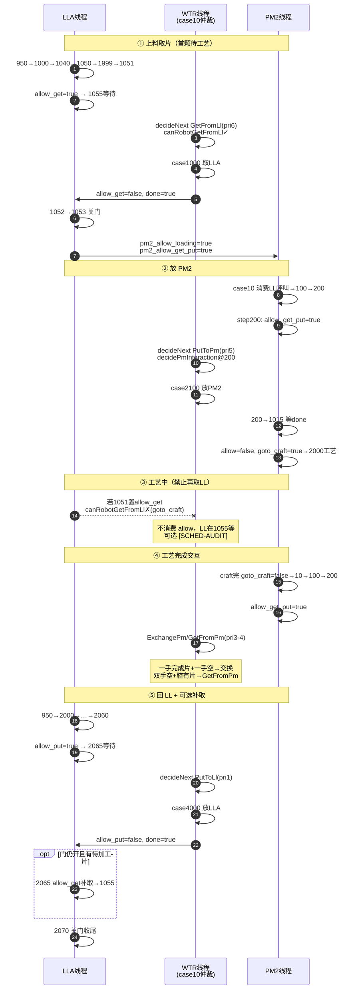

# VTM 调度时序与闸门握手机制

> 适用代码：`device/src/slot_transfer_cycle_vtm_widget.cpp`、`device/src/scheduler/RobotScheduler.cpp`  
> 对齐：`.trae/skills/SchedulerSkills.md`（老项目 permit + WTR 单点仲裁）  
> 更新：2026-06-02

---

## 1. 线程与握手机制总览

```text
┌─────────────┐     permit 置位      ┌──────────────┐     硬件命令      ┌─────┐
│ LLA/LLB线程 │ ── allow_get/put ──► │ WTR case 10  │ ──────────────► │ WTR │
│ (loadlock   │ ◄── 清 allow+done ── │ decideNext   │ ◄────────────── │     │
│  auto_step) │                      └──────────────┘                 └──┬──┘
└──────┬──────┘                               ▲                            │
       │ pm2_allow_loading                    │ SchedulerSnapshot          │
       ▼                                      │                            ▼
┌─────────────┐     pm_allow @ step200 ───────┘                      ┌─────┐
│ PM2 线程    │ ◄── put/get/exch intent ─── applyRobotOp ───────────►│ PM2 │
│ pm2_auto_step│     1015/1045/1065 等待 done                         └─────┘
└─────────────┘
```

### 1.1 四类 permit

| permit | 置位方 | 消费方 | 清位方 |
|--------|--------|--------|--------|
| `loadlock*_allow_get_wafer` | LL 1051 / 2065 补取 | WTR `GetFromLl` | WTR case 1000 / 1100 |
| `loadlock*_allow_put_wafer` | LL 2060 | WTR `PutToLl` | WTR case 4000 / 4100 |
| `pm*_allow_get_put_wafer` | PM `runPmTransferGateStep200`（且 `!goto_craft`） | WTR PM 放/取/交换 | PM 1015 等 legacy 等待步 |
| `pm*_allow_goto_craft` | PM 1015 放片成功 | — | 工艺结束（如 PM2 ~6738） |

### 1.2 设计原则

- **LL 线程**：只置 permit，不 `wtr->createGet/Put`，不 submit 长期 intent。
- **WTR 线程**：`case 10` 唯一仲裁，`decideNextRobotOp` 见 permit 才动作。
- **PM 线程**：step 200 置 `allow_get_put`；工艺与 WTR 取放由 `goto_craft` 互斥。
- **自检**：`FC::auditSchedulerGates()`，违规时打 `[SCHED-AUDIT]`。

---

## 2. PM2 交互片完整时序（主路径）

以 **LLA → PM2 → 工艺 → 回 LLA** 为例（LLB 对称）。



---

## 3. WTR 仲裁优先级（`decideNextRobotOp`）

`case 10` 约每 50ms 构建 snapshot，按 **priority 越小越优先** 选一个 `RobotOp`：

| priority | 操作 | 触发条件 |
|----------|------|----------|
| 1 | `PutToLl` | `ll*_allow_put && !ll*_allow_get`，且手上有片 |
| 3 | `GetFromPm` | PM intent + `canRobotInteractPm` |
| 4 | `ExchangePm` | PM exchange intent + `canRobotInteractPm` |
| 5 | `PutToPm` | PM put intent 或 step200 `decidePmInteraction` |
| 6 | `GetFromLl` | `ll*_allow_get && !ll*_allow_put`，且 `canRobotGetFromLl` |

### 3.1 Robot step 映射

| RobotOp | LLA | LLB | PM2 |
|---------|-----|-----|-----|
| GetFromLl | 1000 | 1100 | — |
| PutToLl | 4000 | 4100 | — |
| PutToPm | — | — | 2100 |
| GetFromPm | — | — | 3100 |
| ExchangePm | — | — | 5100 |

---

## 4. 闸门函数（RobotScheduler）

### 4.1 `canRobotInteractPm`（等同老项目 case 4000）

```text
pm_allow_get_put_wafer == true
AND pm_allow_goto_craft == false
```

### 4.2 `canRobotGetFromLl`

下列 **任一** 成立则 **不消费** `allow_get`：

| # | 条件 | 目的 |
|---|------|------|
| 1 | `pm2_allow_goto_craft` | 工艺中 |
| 2 | `isPm2PutInFlightOrHandoff` | 放 PM2 中 / 放完 handoff 窗口 |
| 3 | PM 腔有片 | 交互阶段，不预取 LL |
| 4 | `pm2_pending>0` 且腔空且任一手有片 | 应先 Put PM2，不取第二颗 |
| 5 | 无物理空手 | `pickEmptyArmFromSnapshot < 0` |

### 4.3 `isPm2PutInFlightOrHandoff`（关死传感器/PM1015 滞后）

| 条件 | 场景 |
|------|------|
| `pm2_step ∈ {1010, 1015, 1030}` | PM 放片 legacy 子步 |
| `put_pm2.requested && !put_pm2.done` | Robot case 2100 进行中 |
| `put_pm2.done && success && !goto_craft && step∈{200,1015}` | 放完→转 craft 前，腔传感可能仍空 |

### 4.4 `canRobotPutToLl`

手上有片（`armWithWaferFromSnapshot >= 0`），且同侧 `allow_put && !allow_get`。

---

## 5. LL 侧 step 路由

### 5.1 case 950 分发

```text
case 950 (UpdateTasks 后)
  ├─ ReturnCompleted > 0  → 5000  出空 cassette
  ├─ ReturnPending > 0    → 2000  回片放 LL（allow_put）
  ├─ Pending > 0          → 1000  取片（→ 1051 allow_get）
  └─ 否则                 → 10    继续上料 / 破真空
```

### 5.2 取片链（LLA / LLB 对称）

```text
1000 → 1010 → 1040 → 1050 → 1999(RQ) → 1051
  → allow_get=true → 1055(等 Robot)
  → 1052 → 1053(关门, 呼叫 PM) → 950
```

**1051 守卫：**

- 若 `allow_put` 未清 → 等待，不置 `allow_get`
- 若已 `allow_get` → 进 1055

**1055 完成条件：**

```text
!allow_get && robot_get_from_*.done
  → success: 1052
  → fail:    950
```

### 5.3 放片链

```text
2000 → 2010 → 2030 → 2040 → 2050 → 2055(RQ) → 2060
  → allow_put=true → 2065(等 Robot)
  → 2070 → 950
```

**2060 守卫：** 若 `allow_get` 未清 → 等待，不置 `allow_put`。

**2065 可选补取：** 放 LL 成功、门仍开、有待加工片、且 `!allow_put` → `allow_get` → 1055。

---

## 6. PM2 侧 step 路由

```text
case 10
  ├─ goto_craft                    → 2000 工艺
  ├─ allow_loading / allow_get_put   → 100（消费 LL 1053 呼叫，清 allow）
  └─ pending / return              → 100

case 100 → 200

case 200  runPmTransferGateStep200
  ├─ !goto_craft → pm_allow_get_put = true
  ├─ put  intent → 1015 → 成功: allow=false, goto_craft=true → 2000
  ├─ get  intent → 1045
  └─ exch intent → 1065 / 1075

case 2000  工艺 …
  └─ 完成 → goto_craft=false, step 10
```

---

## 7. 运行时审计（`auditSchedulerGates`）

WTR `case 10` 每轮调用；违规时每约 40 次打一条：

```text
[SCHED-AUDIT] <原因>
```

| 审计项 | 含义 |
|--------|------|
| `LLA/LLB allow_get and allow_put both set` | 同侧取放 permit 冲突 |
| `PM2 allow_get_put and goto_craft both set` | 工艺与取放互斥破坏 |
| `stale * intent without allow_*` | 仍存在旧 intent 路径（不应出现） |
| `both arms have wafer while PM2 cavity empty` | 双手待工艺禁忌态 |
| `LL allow_get while PM2 put in-flight or handoff window` | 放 PM2 窗口内挂 allow_get |
| `LLx allow_get/put set but robot gate blocks consume` | permit 挂着 Robot 永不消费（会卡住） |

**正常跑片：不应持续出现 `[SCHED-AUDIT]`。**

---

## 8. 不变量自查（对照 SchedulerSkills）

| # | 不变量 | 状态 |
|---|--------|------|
| 1 | WTR 命令仅 `executeTMTransfer` 下发 | ✓ |
| 2 | LL 不直接 `wtr->createGet/Put` | ✓ |
| 3 | permit 与 TaskManager 任务分离 | ✓ |
| 4 | PM 工艺与 WTR 取放互斥（`goto_craft`） | ✓ |
| 5 | 交互片：禁止第二颗待工艺（一手有片 block Get） | ✓ |
| 6 | 同侧 allow_get / allow_put 互斥 | ✓ |
| 7 | 复位清 allow（`resetAllRobotFlags`） | ✓ |
| 8 | 运行时 `auditSchedulerGates` | ✓ |
| 9 | 放 PM2 handoff 窗口 block Get | ✓ |

---

## 9. 现场日志验收表

跑一轮 PM2 交互片，逐项勾选：

```text
□ 首取：step:1051 allow_get → decideNext GetFromLl → case1000 → allow_get=0
□ 放PM2：step200 + pm2_allow=1 → PutToPm → step1015 → goto_craft=1
□ 工艺中：无 GetFromLl 成功；若 allow_get 挂着 → 仅 [SCHED-AUDIT]，无错片
□ 交互：ExchangePm 或 GetFromPm（避免长期 both-arm invalid）
□ 回LL：allow_put → PutToLl pri1 → case4000
□ 全程：无持续 [SCHED-AUDIT]
□ 从未：hasA=1 且 hasB=1 且 pm2 交互/工艺异常持续 >10s
```

### 9.1 idle 心跳（约每 40 次 case 10）

```text
[SCHED] idle hasA=... hasB=... ll1_get=... ll2_get=... ll1_put=... ll2_put=... pm2_allow=...
```

### 9.2 决策日志

```text
[SCHED-L2] decideNext op=... ll=... pm=... arm=... reason=...
```

常见 `reason`：

- `ll_allow_get` / `ll_allow_put`
- `put_pm_arm_*` / `exchange_*` / `get_pm_*`（来自 `decidePmInteraction`）

---

## 10. 与 21:35 现场旧问题对照

| 旧问题 | 现架构结论 |
|--------|------------|
| 放 PM2 中又 GetFromLl | LL 仅 allow；手上有片 / put 窗口 block |
| 放片刚完成双手空再 Get | `isPm2PutInFlightOrHandoff` 挡住 |
| 工艺中第二颗上片 | `goto_craft` block |
| 长期 hasA=1 hasB=1 | 一手有片 block + audit |
| LL/WTR 闸门不一致 | 统一 permit + 单点 decideNext |

---

## 11. 相关源文件

| 文件 | 职责 |
|------|------|
| `device/src/scheduler/RobotScheduler.cpp` | `decideNextRobotOp`、`canRobotGetFromLl`、`auditSchedulerGates` |
| `device/include/scheduler/SchedulerTypes.h` | `SchedulerSnapshot`（allow 字段） |
| `device/src/slot_transfer_cycle_vtm_widget.cpp` | LL/PM step、`runPmTransferGateStep200`、WTR case 10/1000/4000/2100 |
| `.trae/skills/SchedulerSkills.md` | 设计原则与不变量来源 |
| `slot_transfer_cycle_vtm_widget.cpp`（根目录） | 老项目参考实现 |

---

## 12. 剩余边际说明

| 项 | 说明 |
|----|------|
| plain bool permit | 与老项目相同，多线程无 atomic |
| allow 挂着 Robot 不消费 | 不错片，LL 在 1055/2065 等，audit 可见 |
| LLA/LLB 并行 | 各侧独立 allow；WTR 按 priority 择一执行 |

如需关死更多边际，可在 `canRobotGetFromLl` 扩展 PM1–PM4 对称 handoff 规则（当前以 PM2 交互片为主）。
