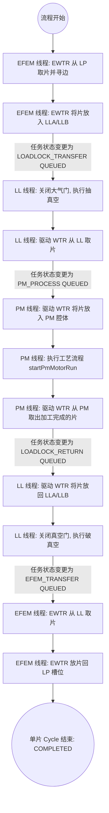
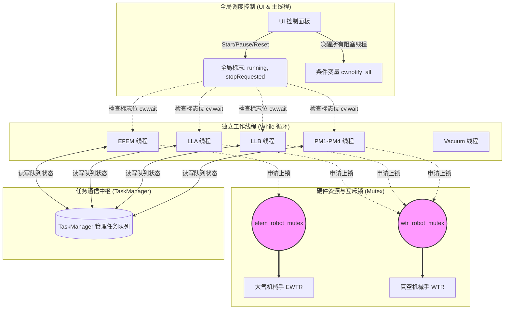
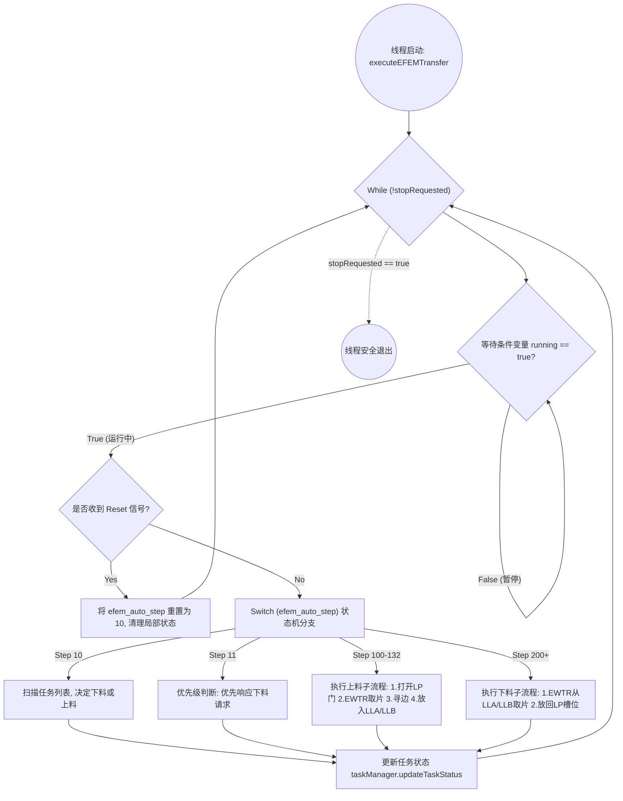

# HL 设备传输流程调度与线程协调分析

本文档基于 `slot_transfer_cycle_vtm_widget.cpp` 的源码分析，整理了多线程 + 状态机模式下的整体调度流程、线程协调机制以及单线程执行逻辑。

## 1. 晶圆整体调度流程图（生命周期）

该图展示了一片晶圆从装载口（LP）出发，经过真空腔体处理，最后回到装载口的完整生命周期流转。不同线程通过修改任务（Task）的状态来进行接力。

## 2. 工作线程协调机制图

该图展示了 9 个工作线程之间是如何通过**条件变量、互斥锁和 TaskManager** 进行同步和资源竞争保护的。

## 3. 单个工作线程的执行流程图（以 EFEM 为例）

每一个工作线程的内部都是一个独立的“状态机（State Machine）”，根据对应的 `xxx_auto_step` 变量执行不同的阶段。

### 机制核心说明：
1. **启停控制（CV 同步）**：所有工作线程在每次循环头部调用 `cv.wait()` 检查 `running` 和 `stopRequested`。当用户点击“暂停”或“重置”时，主线程修改标志位并调用 `cv.notify_all()` 唤醒线程。
2. **硬件防撞（Mutex 互斥锁）**：由于多个线程（LLA、LLB、PM1~PM4）都需要操作唯一的真空机械手（WTR），在调用 WTR 的动作指令前，必须申请 `wtr_robot_mutex` 锁，确保同一时间只有一个线程在驱动手臂。
3. **工序交接（TaskManager）**：线程之间没有直接的代码互相调用，而是通过修改 `TaskManager` 中的 `UnifiedWaferTask::TaskType` 和 `Status` 来实现解耦的异步流水线接力。
