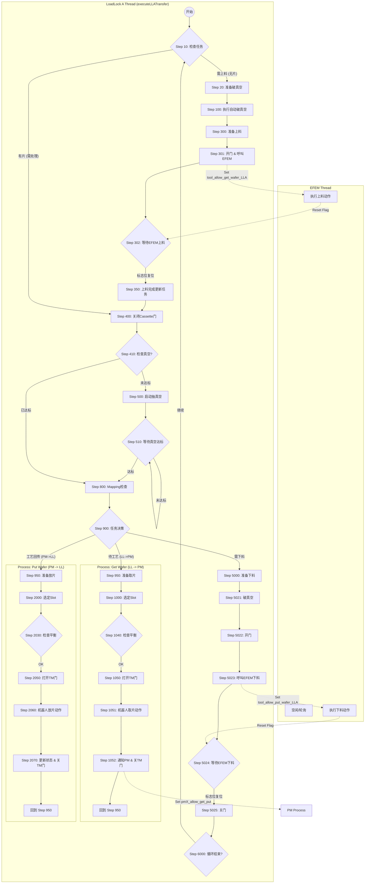

# 多任务传输调度流程逻辑总结

本文档基于 `slot_transfer_cycle_vtm_widget.cpp` 文件，总结了多任务传输调度系统的核心架构、状态机流程及交互逻辑。

## 1. 核心调度架构

该系统采用了 **多线程 + 状态机** 的架构来实现多任务并行调度。

*   **并行任务（Threads）**
    系统启动了多个独立的线程/任务来分别控制不同的硬件子系统，互不阻塞但通过标志位同步。
    *   `executeEFEMTransfer()`: 负责 EFEM 端的机器人调度（LoadPort <-> LoadLock）。
    *   `executeLLATransfer()`: 负责 LoadLock A 的真空/大气循环及与 TM/PM 的交互。
    *   `executeLLBTransfer()`: 负责 LoadLock B 的真空/大气循环及与 TM/PM 的交互。
    *   `executePMxTransfer()`: (PM1-PM4) 负责各个工艺腔室的工艺流程。
    *   `executeTMTransfer()`: 负责传输模块的调度。

*   **同步机制**
    *   **标志位（Flags）**: 使用 `tool_allow_get_wafer_LLA`、`pm1_allow_get_put_wafer` 等布尔标志位在不同线程间握手。
        *   例如：LLA 准备好后置位标志，EFEM 线程检测到标志后执行取放片，完成后复位标志。
    *   **TaskManager**: 全局任务管理器，用于跟踪每个 Wafer 的状态（QUEUED, COMPLETED）和位置，各线程根据任务状态决定下一步动作。

## 2. 详细调度流程逻辑 (以 LoadLock A 为例)

`executeLLATransfer` 是核心函数之一，通过 `loadlock1_auto_step` 变量维护一个状态机：

### 2.1 初始化与判断 (Step 10)
*   检查任务队列。
*   **需上料且无片**：跳转至破真空流程（Step 20）。
*   **有片需处理**：跳转至关门/抽真空流程（Step 400）。
*   **任务完成**：跳转至结束检查（Step 6000）。

### 2.2 上料流程 (Load Cycle)
*   **破真空 (Step 20 -> 100)**: 检查真空度，执行自动破真空 (`createAutoBreakVacuumCommand`)。
*   **请求上料 (Step 300 -> 301)**: 打开 Cassette Door，设置 `tool_allow_get_wafer_LLA = true`，呼叫 EFEM 线程。
*   **等待上料 (Step 302)**: 循环等待直到 EFEM 完成操作（标志位复位）。
*   **上料完成 (Step 350)**: 更新任务状态，准备进入抽真空流程。

### 2.3 抽真空与传输准备 (Vacuum Cycle)
*   **关门 (Step 400)**: 关闭 Cassette Door。
*   **抽真空 (Step 410 -> 500 -> 510)**: 启动真空泵，循环检测真空度是否达到设定值。
*   **Mapping (Step 800 -> 810)**: (可选) 执行晶圆映射。
*   **任务分发 (Step 900 -> 950)**: 根据任务类型决定下一步：
    *   取晶圆去 PM (Step 1000)
    *   从 PM 放回晶圆 (Step 2000)

### 2.4 取晶圆去工艺 (Get Wafer to PM)
*   **准备 (Step 1000 - 1040)**: 选定 Slot，检查 Mapping，确认真空平衡。
*   **开传输门 (Step 1050)**: 打开 TM Cavity Door。
*   **机器人取片 (Step 1051)**: 调用真空机器人 (`WTR`) 从 LL 取片。
*   **调度 PM (Step 1052)**: 更新任务，设置对应 PM 的标志位 (`pmX_allow_get_put_wafer = true`)，通知 PM 开始工作，并关闭 TM 门。

### 2.5 从工艺放回晶圆 (Put Wafer from PM)
*   **准备 (Step 2000 - 2030)**: 选定空 Slot，确认真空平衡。
*   **开传输门 (Step 2050)**: 打开 TM Cavity Door。
*   **机器人放片 (Step 2060)**: 真空机器人将处理好的 Wafer 放回 LL。
*   **完成 (Step 2070)**: 更新任务状态，关闭 TM 门。

### 2.6 下料流程 (Unload Cycle)
*   **准备下料 (Step 5000)**: 确认所有工艺完成。
*   **破真空 (Step 5021)**: 执行破真空。
*   **开门呼叫 (Step 5022 - 5023)**: 打开 Cassette Door，呼叫 EFEM 下料 (`tool_allow_put_wafer_LLA = true`)。
*   **等待下料 (Step 5024)**: 等待 EFEM 取走 Wafer。
*   **结束 (Step 5025 - 6000)**: 关门，完成一次循环。

## 3. 调度流程图 (Mermaid)

以下是基于代码逻辑生成的 Mermaid 流程图，清晰展示了 LLA 线程的状态流转以及与 EFEM 的交互。

## 4. 总结

该文件通过 **LoadLock A** 和 **LoadLock B** 两个并行线程作为中枢，连接大气端（EFEM）和真空端（TM/PM）。
- **EFEM** 负责“喂料”和“收料”。
- **LoadLock** 线程作为“气闸”，在真空和大气状态间切换，并协调机器人将晶圆送入或取出工艺腔。
- **状态机设计** 保证了流程的严谨性，每个步骤（如开关门、抽充气）都有明确的检查和错误处理逻辑。
