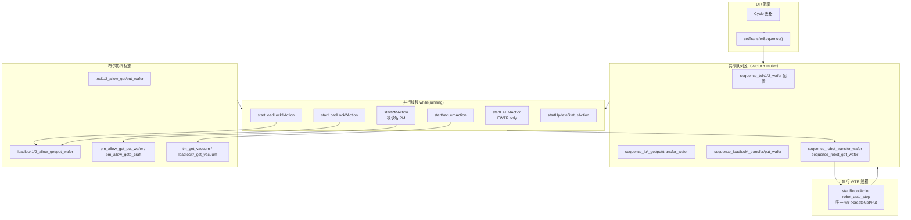
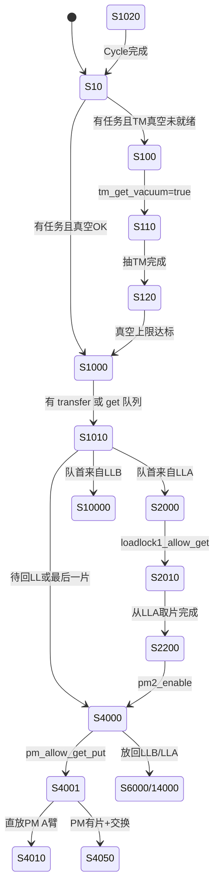
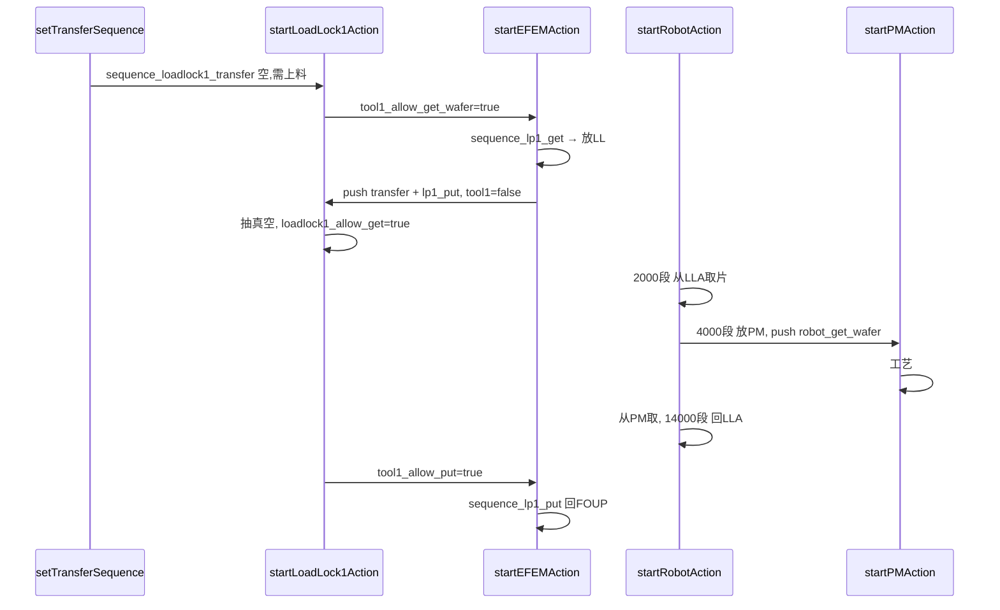

# 老项目 `slot_transfer_cycle_vtm_widget.cpp` 调度系统分析

> **唯一分析对象**：仓库根目录 [`slot_transfer_cycle_vtm_widget.cpp`](../../slot_transfer_cycle_vtm_widget.cpp)（约 9704 行）  
> **不包含**：`device/src/slot_transfer_cycle_vtm_widget.cpp`（新项目，含 TaskManager / `executeTMTransfer` 等，本文一律不涉及）  
> **约束**：仅静态阅读，不修改源码。

---

## 1. 设计意图

在 **2×LoadLock + 1×PM + 1×WTR + EFEM** 的 VTM 设备上，用 **多线程并行准备 + WTR 单线程串行搬运**，完成晶圆闭环：

```text
ELP(FOUP) ──EWTR──► LLA/LLB ──WTR──► PM ──工艺──► PM ──WTR──► LLA/LLB ──EWTR──► ELP
```

任务不通过 TaskManager，而是用 **`sequence_*` 向量队列 + 布尔握手标志** 在各线程间传递「下一片该谁干、能不能干」。

---

## 2. 调度架构图

### 2.1 总体结构



### 2.2 四段搬运与队列对应关系

源码 L227~L239 注释即调度契约：

| 阶段 | 物理动作 | 消费队列 | 生产者 / 消费者 |
|------|----------|----------|-----------------|
| ① LL 上料 | ELP → LL | `sequence_lp*_get_wafer` | EFEM 消费；成功后 push `sequence_loadlock*_transfer_wafer` + `sequence_lp*_put_wafer` |
| ② PM 上料 | LL → PM | `sequence_robot_transfer_wafer`（母队列） | **Robot** 从 LL 取→放 PM；成功后 push `sequence_robot_get_wafer` |
| ③ PM 下料 | PM → LL | `sequence_robot_get_wafer` | **Robot** 从 PM 取→按 `target_loadlock` 放回 LL；成功后从母队列删头项 |
| ④ LL 下料 | LL → ELP | `sequence_lp*_put_wafer` | EFEM 消费 |

```text
配置行 sequence_tolk*_wafers
        │
        ▼
sequence_lp*_get_wafer ──EFEM──► sequence_loadlock*_transfer_wafer
                          │              │
                          │              └──► sequence_robot_transfer_wafer（母队列）
                          └──► sequence_lp*_put_wafer（预登记回 FOUP）

sequence_robot_transfer_wafer ──WTR放PM──► sequence_robot_get_wafer
sequence_robot_get_wafer ──WTR回LL──► 删除母队列首项 + sequence_loadlock*_put_wafer 维护

sequence_lp*_put_wafer ──EFEM──► 回 FOUP，一轮结束
```

### 2.3 WTR 在架构中的位置

```text
  LLA线程 ──loadlock1_allow_get_wafer=true──┐
  LLB线程 ──loadlock2_allow_get_wafer=true──┤
  PM线程  ──pm_allow_get_put_wafer=true─────┼──► startRobotAction() 轮询标志后执行
                                            │         │
                                            │         ▼
                                            └──   wtr->createGet/Put + wait()
                                                  （全文件真空侧唯一下发点）
```

LL/PM/EFEM **不**在各自线程里调用 WTR 的 get/put（与 `device/src` 新版的「请求标志 + Robot 线程」不同；老版是 **标志 + Robot 线程内直接发命令**）。

---

## 3. 核心职责划分

### 3.1 配置层（`setTransferSequence`）

- 从 UI 表格解析为 `LPTransferWafer` / `RobotTransferWafer` 行。
- 填入 `sequence_tolk1_wafer`、`sequence_tolk2_wafer`、`sequence_robot_transfer_wafer` 及 LP 侧 `sequence_lp*_transfer_wafer`。
- `*_copy` 向量供 Update 线程在多轮 Cycle 时恢复。
- 支持 **全自动** 与 **半自动**（`semi_auto_mode`，分阶段 `SemiAutoPhase`）。

### 3.2 EFEM 线程 — `startEFEMAction`

- **独占 EWTR**（`EFEMWaferRobotSubsystem`）：LP 开盒、MAP、取片、放 LL。
- 响应 `tool1_allow_get_wafer` / `tool2_allow_put_wafer` 等（TOOL1≈LLA/LP1，TOOL2≈LLB/LP2）。
- 上料完成：向 `sequence_loadlock*_transfer_wafer` 追加 `LoadLockTransferWafer`，并向 `sequence_lp*_put_wafer` **预登记** 回片目标。
- 步号区间：`100~159`（TOOL1 上料）、`200~257`（TOOL1 下料）、`1000~1599`（TOOL2 上料）、`2000~2507`（TOOL2 下料）。

### 3.3 LLA / LLB 线程 — `startLoadLock1Action` / `startLoadLock2Action`

- 破真空、关门、抽真空、mapping、移槽、开关 TM/ cassette 门。
- **节拍闸门**：
  - `tool*_allow_get_wafer = true` → 呼叫 EFEM 上料；
  - `loadlock*_allow_get_wafer = true` → 允许 Robot 从本 LL **取片**；
  - `loadlock*_allow_put_wafer = true` → 允许 Robot **回片**到本 LL；
  - `tool*_allow_put_wafer = true` → 呼叫 EFEM 下料。
- 维护 `sequence_loadlock*_transfer_wafer`（待 WTR 取走）与 `sequence_loadlock*_put_wafer`（已从 LL 取走、待回片）。
- 写操作用 `vec_mutex_lla` / `vec_mutex_llb` 保护。

### 3.4 Robot / WTR 线程 — `startRobotAction`（核心）

- **真空侧唯一执行者**：所有 `wtr->createGetCommand` / `createPutCommand` 均在此 `switch (robot_auto_step)` 内。
- 读队列队首 `sequence_robot_transfer_wafer[0]` / `sequence_robot_get_wafer[0]` 决定 LLA(2000 段) / LLB(10000 段) / PM(4000 段) / 回 LL(6000/14000 段)。
- 根据 PM 是否有片、双臂 mapping，在 `case 4001` 分支：**直放 / 双臂交换取放 / 只取**（4050/4070/4090 等）。
- 放 PM 成功后：`sequence_robot_get_wafer.push_back(队首)`，登记「稍后要从 PM 取回」。
- 与 PM 协作：`pm_allow_get_put_wafer`、`pm_allow_goto_craft` 由 Robot 与 PM 线程交替置位/清除。

### 3.5 PM 线程 — `startPMAction`

- 单腔：内核模块名 **`"PM"`**（代码变量常写作 `pm2`）。
- `case 100`：转到取放位，`pm_allow_get_put_wafer = true`。
- Robot 放片后 `pm_allow_goto_craft = true` → `case 2000` 转工艺位并 `createToPutStationCommand` 循环工艺。
- 工艺完成回取放位，再次允许 WTR 取片（与 Robot `case 4000` 等待 `pm_allow_get_put_wafer` 配合）。

### 3.6 Vacuum 线程 — `startVacuumAction`

- 响应 `tm_get_vacuum`、`loadlock1_get_vacuum`、`loadlock2_get_vacuum`。
- Robot 在需要时置 `tm_get_vacuum = true`（`case 100`），等真空完成后继续搬运。
- 与 WTR 时序耦合：抽真空前需满足设备安全条件（与 LL 门阀、WTR 位置相关逻辑分散在 Robot/LL case 中）。

### 3.7 Update 线程 — `startUpdateStatusAction`

- 判断 `finished_time_lla/llb` 与 `cycle_times_*`。
- 未达上限：从 `sequence_robot_transfer_wafer_lp1/lp2`、`sequence_tolk*_wafer_copy` 等 **重装填** 运行队列。
- 达上限：置 `cycleFinished_lla/llb`，通知 Robot `case 1020` 收尾。

---

## 4. 状态机设计

### 4.1 通用特征

- 每线程一个 **`int *_auto_step`**，主循环 `while (running) { switch (*_auto_step) { ... } Sleep(...) }`。
- 全局 `bool running` / `ispause` 控制启停（无新版的 `condition_variable` 统一暂停）。
- 步号为 **魔法数字**，语义靠区间与日志名（`LLA流程步骤` 等）记忆。

| 线程函数 | 步号变量 |
|----------|----------|
| `startEFEMAction` | `efem_auto_step` |
| `startLoadLock1Action` | `loadlock1_auto_step` |
| `startLoadLock2Action` | `loadlock2_auto_step` |
| `startRobotAction` | `robot_auto_step` |
| `startPMAction` | `pm_auto_step` |
| `startVacuumAction` | `vacuum_auto_step` |
| `startUpdateStatusAction` | `update_auto_step` |

### 4.2 Robot / WTR 状态机（`robot_auto_step`）



**步号区间速查**：

| 区间 | 含义 |
|------|------|
| 10 | 空闲；检查 `sequence_robot_*` 是否有活 |
| 100~120 | TM 抽真空握手 |
| 1000~1020 | 任务分类 / Cycle 结束 |
| 1010 | 按队首 `source_loadlock` / `target_loadlock` 选 2000/10000/4000 |
| 2000~2250 | 从 **LLA** 取片（依赖 `loadlock1_allow_get_wafer`） |
| 10000+ | 从 **LLB** 取片（对称） |
| 4000~409x | **PM** 放片 / 交换 / 取片 |
| 6000+ | 向 **LLB** 回片 |
| 14000+ | 向 **LLA** 回片 |
| 20000 | 清理母队列已完成项 |

`case 4001` 根据 `cassManager` 读 PM 槽位与 WTR 双臂 mapping 选择分支，是 **交换料策略集中点**：

```text
!haswaferpm && haswaferarm1  → 4010 放片(A)
!haswaferpm && haswaferarm2  → 4030 放片(B)
haswaferpm && !arm1 && arm2   → 4050 先取后放（交换）
haswaferpm && arm1 && !arm2   → 4070 交换（另一顺序）
haswaferpm && 双臂无片       → 4090 只取
```

### 4.3 LLA 状态机主干（`loadlock1_auto_step`）

与 LLB 对称，典型链路：

```text
10  判断：需上料 / 有片待处理 / 本轮结束(6000)
20→100  破真空
300→302  tool1_allow_get_wafer=true，等 EFEM
400~510  关门、抽真空、开 TM 门
800~950  mapping、移槽
1000~1070  loadlock1_allow_get_wafer=true，等 Robot 取走 → 移入 sequence_loadlock1_put_wafer
2000~2070  loadlock1_allow_put_wafer=true，等 Robot 回片
5000~5025  破真空、tool1_allow_put_wafer=true，EFEM 回 FOUP
```

### 4.4 PM 状态机（`pm_auto_step`）

```text
10   等待 allow 标志变化
100  去取放位 → pm_allow_get_put_wafer=true
200  等待 Robot 交互结束
2000 去工艺位（pm_allow_goto_craft）
2100 执行工艺循环
2200 工艺完成回取放位 → 再次允许 WTR
2110 工艺失败人工确认
```

### 4.5 半自动叠加（`semi_auto_mode`）

- 阶段：`LLLoad → PMLoad → PMUnload → LLUnload`（`SemiAutoPhase`）。
- Robot `case 10` 在半自动下仅当当前阶段允许时才进入 `1000`（例如 PMLoad 需匹配 `semi_auto_pm_load_target_mask` 与 `loadlock*_allow_get_wafer`）。
- LL `case 10` 在非 `LLLoad` 阶段不发起上料。
- 与全自动共用同一 `startRobotAction`，靠原子阶段变量 **闸门** 而非独立线程。

---

## 5. 任务流转过程

### 5.1 单片全自动时序（逻辑）



### 5.2 队列互斥

| 互斥量 | 保护对象 |
|--------|----------|
| `vec_mutex_robot` | `sequence_robot_transfer_wafer` 等 Robot 母队列 |
| `vec_mutex_lla` | `sequence_loadlock1_transfer_wafer` |
| `vec_mutex_llb` | `sequence_loadlock2_transfer_wafer` |

多线程 **push/erase/swap 队首** 时必须加锁；布尔标志 **无锁读写**，依赖「置位 → 对方清位」顺序约定。

### 5.3 队首假设

Robot `case 1010` 以 `sequence_robot_transfer_wafer[0]` / `sequence_robot_get_wafer[0]` 为当前任务；半自动 PMLoad 时可能 `std::swap` 将目标 LL 项换到队首。调度正确性依赖 **各阶段只往队尾 push、完成后删首或登记 get 队列** 的纪律。

---

## 6. 线程模型

### 6.1 启动（`onStart`，约 L9257）

`clickStart` → `onStart` 在 **`running = true`** 后 **detach 启动 7 条线程**：

| 顺序 | 线程入口 | 角色 |
|------|----------|------|
| 1 | `startVacuumAction` | 真空 |
| 2 | **`startRobotAction`** | **WTR** |
| 3 | `startLoadLock1Action` | LLA |
| 4 | `startLoadLock2Action` | LLB |
| 5 | `startPMAction` | PM（单腔） |
| 6 | `startUpdateStatusAction` | 轮次 |
| 7 | `startEFEMAction` | EFEM |

另：`onProcess` 可再起真空相关线程（L8774）；`resetAction` 独立 detach。

### 6.2 协同三元组

1. **`sequence_*` 队列** — 承载「还有哪些片、从哪到哪」  
2. **布尔标志** — 承载「当前是否允许下一步硬件动作」  
3. **`std::mutex`** — 仅保护 vector 并发修改  

**分层**：

```text
并行：EFEM、LLA、LLB、PM、Vacuum、Update
串行：startRobotAction（WTR 命令）
```

### 6.3 与「新项目」线程模型对比（便于区分）

| 项目 | 老文件（本文） | `device/src` 新文件 |
|------|----------------|---------------------|
| 任务模型 | `sequence_*` 向量 | TaskManager + UnifiedWaferTask |
| WTR 入口 | `startRobotAction` | `executeTMTransfer` |
| LL→WTR | `loadlock*_allow_get_wafer` | `robot_get_from_lla.requested` |
| PM 数量 | 1×PM 线程 | 4×PM 线程 |

---

## 7. WTR 单线程：重要性与合理性

### 7.1 为何必须集中

- 物理上 **一台 WTR、双臂共享** 运动上下文，同时只能执行一条真空搬运链。
- 交换料、回 LL、从 LL 取片共用同一 `robot_auto_step`，需在 **同一状态机** 里读 PM/手臂 mapping 并决策。

### 7.2 老版的实现方式

- **不是**「业务线程发原子请求、Robot 只消费请求」（那是新版的 `RobotTransferRequest`）。
- **而是**：LL/PM 只置 `loadlock*_allow_*` / `pm_allow_*`；**Robot 线程**在循环内看到标志 + 队首任务后 **自己** `wtr->startCommand`。
- 效果相同：**除 `startRobotAction` 外，无第二处真空 get/put**，避免命令竞争。

### 7.3 若拆到多线程直控 WTR 的风险

1. 与 PM 的 `pm_allow_*` 竞态，易出现「PM 认为可放、WTR 同时在取」。  
2. 双臂占用与 `robot_selected_arm` 分裂在 LL/PM 两处维护。  
3. `sequence_robot_transfer_wafer` 队首与真实手臂状态不一致。  
4. 真空抽吸与手臂伸入时序错乱。

### 7.4 结论

老项目把 WTR 放在 **`startRobotAction` 单线程**，是 **共享硬件串行化** 的正确做法；LL/PM/EFEM 并行只做 **环境准备与队列/标志维护**，不抢 WTR 命令通道。

---

## 8. 优缺点分析

### 8.1 优点

| 维度 | 说明 |
|------|------|
| 贴合产线 | 四段队列命名与工艺段一致，工程师可按 `sequence_robot_get_wafer` 追踪 PM 回收 |
| WTR 收敛 | 真空搬运命令单线程，互锁集中 |
| 并行准备 | 双 LL 可分别抽真空、EFEM 可与 LL 并行上下料准备 |
| 交换料 | `case 4001` 双臂+PM mapping 一次决策 |
| 多轮 Cycle | `*_copy` + Update 线程重装填，与 UI cycle 次数联动 |
| 半自动 | 同一套状态机加阶段闸门，复用度高 |

### 8.2 缺点

| 维度 | 说明 |
|------|------|
| 可维护性 | 单文件近万行，步号难读，LLA/LLB/EFEM 大量重复 |
| 队首敏感 | `[0]` 假设强，swap 逻辑分散，易在边界顺序出错 |
| 标志过多 | `tool_*` / `loadlock_*` / `pm_*` 置位清位分散，无统一状态图 |
| 线程生命周期 | 全 detach，`running=false` 停止，异常路径依赖日志+人工 |
| 单 PM | `PM` 单腔，扩展多 PM 需复制 Robot 4000 段逻辑（新项目才拆 PM1~4） |
| 全局 running | 各线程忙等 `Sleep`，无精细条件变量（CPU 占用与响应延迟一般） |

---

## 9. 关键源码锚点

| 主题 | 约略行号 |
|------|----------|
| 队列与四段说明注释 | L227~L315 |
| 数据结构 `RobotTransferWafer` 等 | L147~L174 |
| 线程启动 `onStart` | L9257~L9270 |
| EFEM 分发 `case 10` | L1196 |
| Robot 空闲与分类 `case 10/1010` | L3996~L4164 |
| 从 LLA 取片 `2000~` | L4192 |
| PM 交互 `4000~4090` | L4419~L4573 |
| LLA 主循环 `startLoadLock1Action` | L5809 |
| PM 工艺 `startPMAction` | L7466 |
| 半自动枚举 | L425~L458 |

---

## 10. 总结

根目录 **`slot_transfer_cycle_vtm_widget.cpp`** 是一套典型的 **「队列驱动 + 标志握手 + 分设备线程 + WTR 单线程执行」** 传片调度：

1. **任务载体**是 `sequence_*`，不是 TaskManager。  
2. **LL** 是大气/真空边界，用 `tool_*` / `loadlock_*` 协调 EFEM 与 WTR。  
3. **WTR** 在 `startRobotAction` 中串行完成 LL↔PM↔LL，并根据 PM/手臂状态做交换料。  
4. **PM 线程** 只管腔体位置与工艺，通过 `pm_allow_*` 与 Robot 握手。  

设计目标明确：**在多互锁条件下稳定跑通 LP→LL→PM→LL→LP**；WTR 独占一线程是该老项目最合理、也最核心的架构选择。

---

*文档仅对应仓库根目录 `slot_transfer_cycle_vtm_widget.cpp`。*
